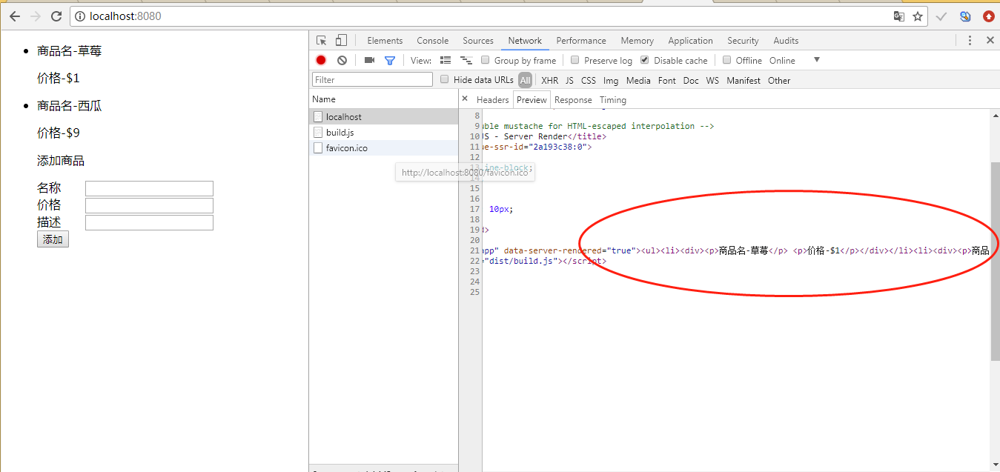
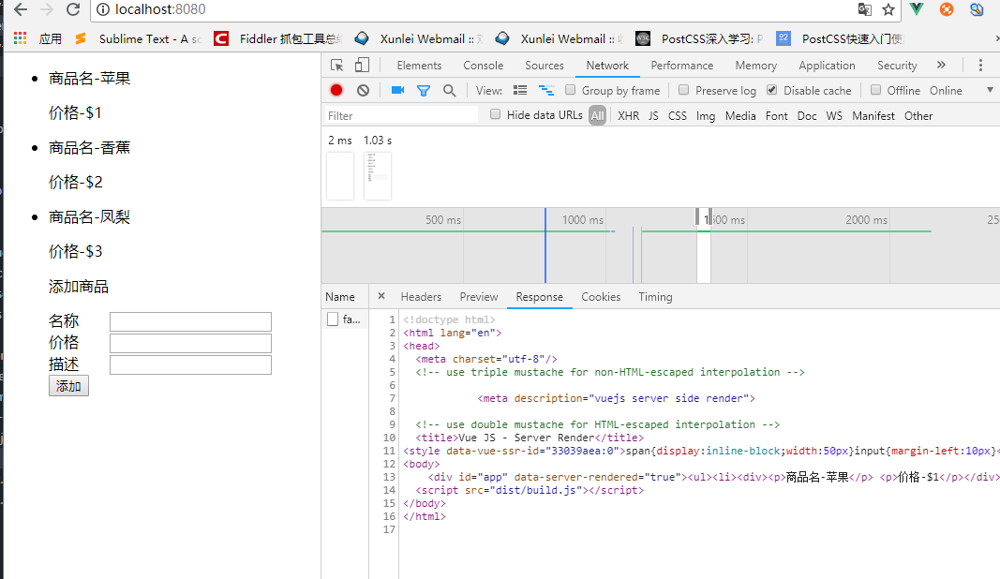
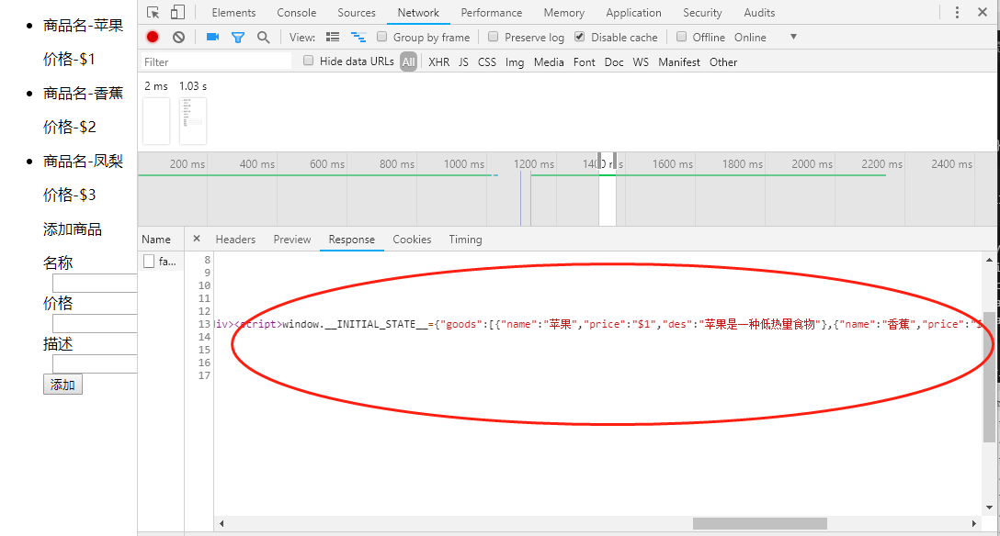

## 聊聊 VUE 服务端渲染

### 本文内容

- 1.什么是服务端渲染
- 2.为什么需要服务端渲染
- 3.服务端渲染过程
- 4.相关 API 介绍
- 5.通过例子深入理解 SSR
- 6.总结

### 1.什么是服务端渲染

Vue.js 是构建客户端应用程序的框架。默认情况下，可以在浏览器中输出 Vue 组件，进行生成 DOM 和操作 DOM。然而，也可以将**同一个组件渲染为服务器端的 HTML 字符串**，将它们直接发送到浏览器，最后将静态标记"混合"为客户端上完全交互的应用程序。

原理图如下：  


### 2.为什么需要服务端渲染

与传统 SPA（Single-Page Application - 单页应用程序）相比，服务器端渲染(SSR)的优势主要在于

- 更好的 SEO，由于搜索引擎爬虫抓取工具可以直接查看完全渲染的页面，传统 SPA 通常是加载页面后异步请求数据渲染，而搜索引擎抓取工具不会等异步请求并渲染完成后再抓取。
- 更快的内容到达时间(time-to-content)，特别是对于缓慢的网络情况或运行缓慢的设备。无需等待所有的 JavaScript 都完成下载并执行，才显示服务器渲染的标记，所以你的用户将会更快速地看到完整渲染的页面。

### 3.服务端渲染过程

要讲述其渲染过程，首先要了解 SSR(服务端渲染)主要组成部分，其主要分成以下部分。

- 通用代码部分  
  这部分主要是服务端入口文件和客户端入口文件通用的代码，主要有 components store router 这三部分。
- 服务端入口  
  这个部分负责处理请求，根据路由加载相应的组件，并调用组件的预加载数据操作，设置 store,最终返回一个 hmtl 字符串和 state 序列化后的数据给客户端。
- 客户端入口  
   这个部分就是通常的 vue 客户端开发的代码，这里还有一个操作就是在组件挂载前将服务端返回的 state 设置到客户端的 store 中。
  其大致流程如下图所示：  
  

### 4.相关 API 介绍

- 1.renderer.renderToString

这是 Vue 官方提供的 vue-server-renderer 模块里面的某个方法，这个 vue-server-renderer 模块就是 SSR 需要用到的核心模块。
其用法如下。

```js
const { createRenderer } = require('vue-server-renderer')
const renderer = createRenderer({ /* options */ })
renderer.renderToString(vm, context?, callback?): ?Promise<string>
```

该方法接受一个 Vue 实例，可选的上下文对象和可选回调函数，当没有传递回调函数的时候，该方法返回一个 Resolve 态包含返回字符串的 Promise。如果传递了，则回调函数内参数为相应的字符串和错误状态。在这个方法中，**只**会调用匹配的组件的生命周期钩子函数 beforeCreate 和 created。

所以官网有以下的建议： 　　  
你应该避免在 beforeCreate 和 created 生命周期时产生全局副作用的代码，例如在其中使用 setInterval 设置 timer。在纯客户端(client-side only)的代码中，我们可以设置一个 timer，然后在 beforeDestroy 或 destroyed 生命周期时将其销毁。但是，由于在 SSR 期间并不会调用销毁钩子函数，所以 timer 将永远保留下来。为了避免这种情况，请将副作用代码移动到 beforeMount 或 mounted 生命周期中。

- 2 store.replaceState

使用方式如下

```JAVASCRIPT
store.replaceState(state: Object)
```

其作用的是用给定的 state 对象来替换 store 对应实例的 state 对象

### 4.通过例子深入理解

下面我们来一步步实现服务端渲染

- 通用代码部分  
  1.首先是页面部分

```HTML
/*
* 页面App.vue html部分
*/
<template>
    <div id="app">
      <ul>
         <li
           v-for="(good, index) in goods"
           :key="good.name"
         >
           <good :good="good"></good>
         </li>
          <div>
             <p>添加商品</p>
             <div>
                <span>名称</span>
                <input type="text" v-model="goodName"/>
             </div>
             <div>
                <span>价格</span>
                <input type="number" v-model="goodPrice"/>
             </div>
             <div>
                <span>描述</span>
                <input type="text" v-model="goodDes"/>
             </div>
              <button @click="addGood">添加</button>
          </div>
      </ul>
    </div>
</template>
```

```JAVASCRIPT
/*
* 页面App.vue js部分
*/
  import good from './components/good.vue'
  export default {
    components: {
      good
    },
    data () {
      return {
        goodName: '',
        goodPrice: '',
        goodDes: '',
        goods: [
          {
            name: '草莓',
            price: '$1',
            des: '草莓（学名：Fragaria × ananassa Duch.），多年生草本植物。'
          },
          {
            name: '西瓜',
            price: '$9',
            des: '西瓜（学名：Citrullus lanatus (Thunb.) Matsum. et Nakai）'
          }
        ]
      }
    },
    methods: {
      addGood () {
        let good = {
          name: this.goodName,
          price: `${this.goodPrice}`,
          des: this.goodDes
        }
        this.goods.push(good);
      }
    }
  };
```

3.vue 入口文件 main.js
主要用于返回一个 vue 实例对象

```JAVASCRIPT
// main.js
import Vue from 'vue'
import App from './App.vue'
/*
*导出一个工厂函数，用于返回一个新的vue实例对象
*这是为了防止交叉请求状态污染
*/

export function createApp() {
    const app = new Vue({
        render: h => h(App)
    });

    return { app };
}
```

- 客户端入口  
  客户端比较简单，只需要做一个挂载的操作  
  1.客户端入口文件 entry-client.js  
  用于客户端渲染部分,这里只需要将 vue 实例挂载到 dom 上

```JAVASCRIPT
// entry-client.js
import { createApp } from './main.js';
const { app } = createApp()
app.$mount('#app')
```

- 服务端入口
  服务端入口是 ssr 最核心的部分，其主要做的是根据路由，匹配组件，将组件转化成 html 字符串，再返回给浏览器。

  1.首先是 entry-server.js
  这里一般主要做的是路由匹配和组件数据的预加载，这里为了简单演示就直接 resolve 返回了.

```JAVASCRIPT
// entry-server.js
import { createApp } from './main.js';
export default context => {
  return new Promise((resolve, reject) => {
      const { app } = createApp();
      resolve(app)
    }, reject);
}
```

2.服务端请求处理文件 server.js  
这里主要的作用是开启一个 node 服务，将请求的路径传递给了 server.bundle.js 里面，从这里拿到 vue 实例，用 renderToString 方法将实例转化成字符串，并返回给浏览器。

```JAVASCRIPT
const express = require('express');
const server = express();
const fs = require('fs');
const path = require('path');
//这里假设entry-server被打包成了server.bundle.js
const bundle =  require('./dist/server.bundle.js');
const renderer = require('vue-server-renderer').createRenderer({
  template: fs.readFileSync('./index.html', 'utf-8')
});

server.use('/dist', express.static(path.join(__dirname, './dist')));

server.get('*', (req, res) => {
   const context = {
      title: 'Vue JS - Server Render',
      meta: `
        <meta description="vuejs server side render">
      `,
      url: req.url

  };
  bundle.default(context).then((app) => {
    renderer.renderToString(app, context, function (err, html) {
      if (err) {
        if (err.code === 404) {
          res.status(404).end('Page not found')
        } else {
          res.status(500).end('Internal Server Error')
        }
      } else {
        res.end(html)
      }
    });
  }, (err) => {
    console.log(err);
  });
});
server.listen(8080);
```

下面是其渲染结果：

由图中可以看到，服务端将一整个 html 字符串都返回给浏览器了，这对于搜索引擎抓取工具是十分友好的。

也许你会问，实际中的业务逻辑会涉及到 vuex 的状态数据获取，这个服务端渲染是如何处理呢？
仔细分析，在以往的 SPA 开发过程中，我们一般会在组件的渲染前去请求服务端的数据，常见的做法是在 mounted 生命周期之前调用相应的请求逻辑，前面说到，服务端渲染时，会调用组件的 beforeCreate 和 created 生命周期函数，那么我们是否可以在这两个函数里面去进行数据获取呢？

答案是否，原因在于向服务端请求数据一般都是异步操作，服务端渲染时，如果在这两个生命周期函数调用异步请求设置 state,会导致 html 字符串已经渲染完并返回给浏览器，但此时异步请求还未完成的情况，所以我们必须先完成异步请求后再渲染成字符串，代码如下

```JAVASCRIPT
// 这里用定时器模仿异步请求
import Vuex from 'vuex'
import Vue from 'vue';
Vue.use(Vuex)
export function createStore() {
  return new Vuex.Store( {
    state: {
      goods: []
    },
    mutations: {
      setGoods (state, goods) {
        state.goods = goods
      },
      addComment(state, item) {
        state.goods.push(item)
      }
    },
    actions: {
      fetchGoods (context) {
        return new Promise((resolve, reject) => {
          setTimeout(() => {
            let goods = [
              {
                name: '苹果',
                price: '$1',
                des: '苹果是一种低热量食物'
              },
              {
                name: '香蕉',
                price: '$2',
                des: '香蕉（学名：Musa nana Lour.）'
              },
              {
                name: '凤梨',
                price: '$3',
                des: '凤梨（学名：Ananas comosus (Linn.) Merr.）'
              }
            ]
            resolve(goods);
          }, 1000);
        }).then((data) => {
          context.commit('setGoods', data);
        })
      }
    }
  })
}
```

我们修改一下 main.js 的代码

```JAVASCRIPT
// main.js
export function createApp() {
    const store = createStore();
    const app = new Vue({
        store,
        render: h => h(App)
    });
    return { app };
}
```

app.vue 文件 js 代码

```JAVASCRIPT
  import good from './components/good.vue'
  export default {
    components: {
      good
    },
    data () {
      return {
        goodName: '',
        goodPrice: '',
        goodDes: '',
        goods: []
      }
    },
    created () {
      this.goods = this.$store.state.goods;
    },
    methods: {
      addGood () {
        let good = {
          name: this.goodName,
          price: `${this.goodPrice}`,
          des: this.goodDes
        }
        this.goods.push(good);
      }
    }
  };
```

entry-server.js

```JAVASCRIPT
import { createApp } from './main.js';

export default context => {
  return new Promise((resolve, reject) => {
    const { app } = createApp();
    app.$store.dispatch('fetchGoods')
      .then(()=> {
        resolve(app)
      })
  });
}
```

结果如下:

可见服务端已成功返回了请求并渲染好的 html 字符串。

但是奇怪的是，浏览器的渲染结果却和服务端返回的 html 字符串不一样，这是为什么呢？

这是因为我们目前是只设置了服务端的 store，而客户端此时 store 的数据是没有的，所以会导致服务端返回的 html 结构和客户端渲染的不一致，根据官网的说法:

在开发模式下，Vue 将推断客户端生成的虚拟 DOM 树(virtual DOM tree)，是否与从服务器渲染的 DOM 结构(DOM structure)匹配。如果无法匹配，它将退出混合模式，丢弃现有的 DOM 并从头开始渲染。在生产模式下，此检测会被跳过，以避免性能损耗

也就是说，在开发的模式下，会将服务端返回的 dom 和客户端的生成的 dom 对比和，如果不匹配，则用客户端的，在生产环境中，则跳过对比的阶段，直接用客户端的 dom。

下面我们来修改以下代码，使客户端的 store 和服务端的 store 数据一致，从而时两者的 dom 结构一样

第一步，在 server.js 里面将 contenx 上下文对象传递给 entry-sever.js

```JAVASCRIPT
server.get('*', (req, res) => {
    const context = {
        title: 'Vue JS - Server Render',
        meta: `
            <meta description="vuejs server side render">
        `,
        url: req.url
    };
    bundle.default(context).then((app) => {
      renderer.renderToString(app, context, function (err, html) {
          if (err) {
            if (err.code === 404) {
              res.status(404).end('Page not found')
            } else {
              res.status(500).end('Internal Server Error')
            }
          } else {
            res.end(html)
          }
        });
    }, (err) => {
        console.log(err);
    });
});
server.listen(8080);
```

第二步，在 enrty-server.js 中拿到 store 设置并设置给 context

```JAVASCRIPT
// entry-server.js
import { createApp } from './main.js';
export default context => {
  return new Promise((resolve, reject) => {
    const { app } = createApp();
    app.$store.dispatch('fetchGoods')
      .then(()=> {
         // 状态将自动序列化为 `window.__INITIAL_STATE__`，并注入 HTML。
        context.state = app.$store.state
        resolve(app)
      })
  });
}
```

第三步，在客户端将服务端返回的 store 设置给客户端的 store

```JAVASCRIPT
// entry-client.js
import { createApp } from './main.js';
const { app } = createApp()
app.$store.replaceState(window.__INITIAL_STATE__)
app.$mount('#app')
```

最后其运行结果如下：  



由图上，可以看到，在客户端返回的 html 字符串中，state 数据被设置到了 window**INITIAL_STATE**上，这是 vue-server-render 里面自动的操作，所以我们便可以根据这个来设置客户带的 state,使两者的 store 数据一致。

### 6.总结

上面的例子简单的演示了 SSR 的过程，实际的应用过程比较复杂，但是原理都类似。在服务器端渲染(SSR)期间，我们本质上是在渲染我们应用程序的"快照"，对于一些依赖的异步数据，是放到了服务端请求和渲染，同时将数据传递给了客户端。
