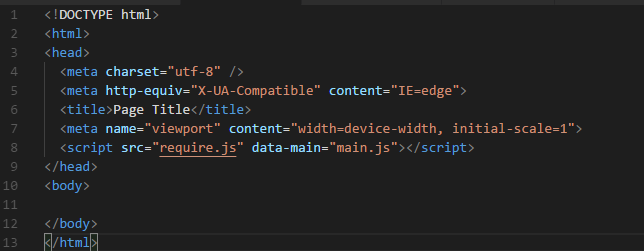
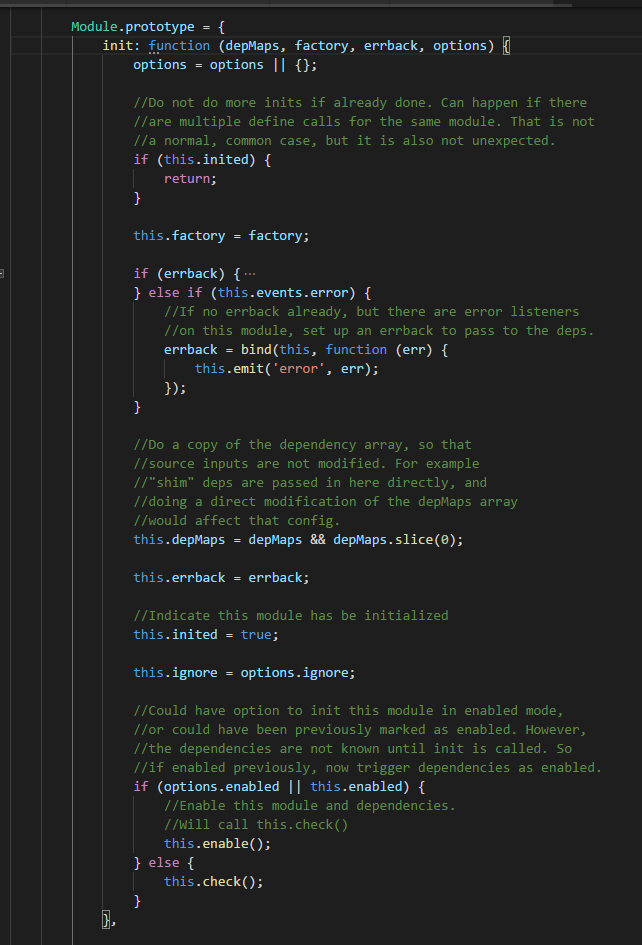
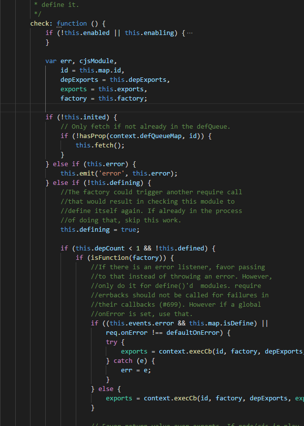
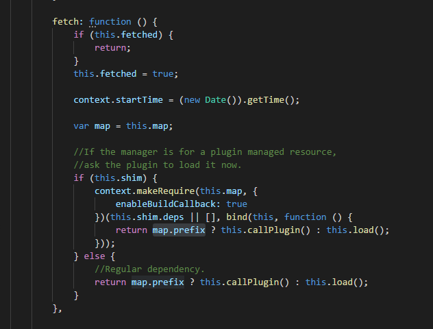
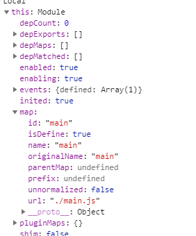
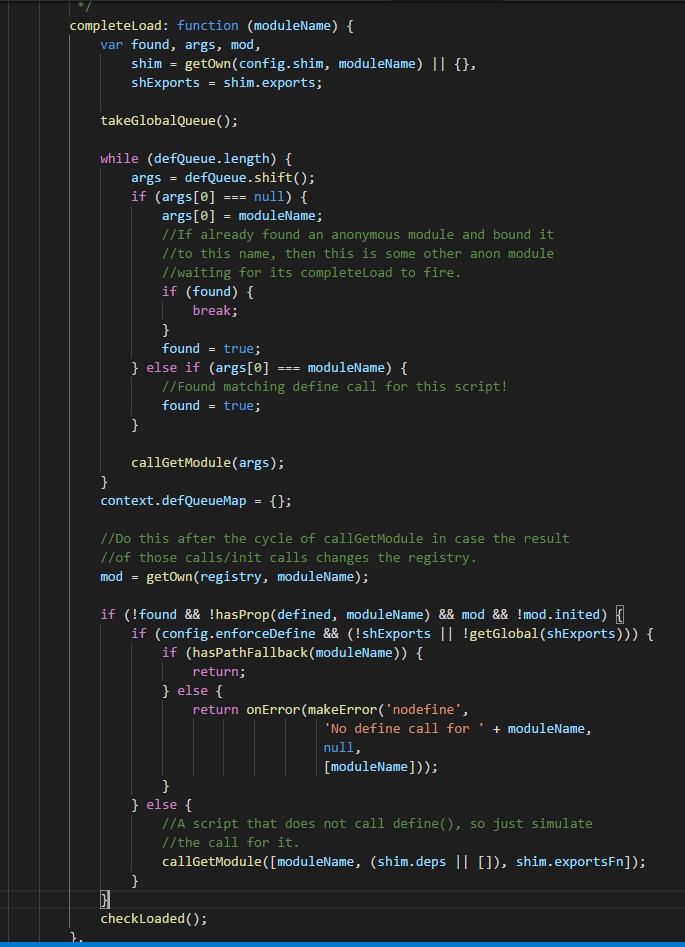

### 本文内容
- 1.什么是模块？  
- 2.为什么需要模块化？  
- 3.Javascript模块化之-Commonjs
- 4.Javascript模块化之-AMD/CMD
- 5.Javascript模块化之-ES module 
- 6.几种模块化比较

### 1.什么是模块？
模块,又称构件,是能够单独命名并独立地完成一定功能的程序语句的集合（即程序代码和数据结构的集合体）。它具有两个基本的特征：外部特征和内部特征。外部特征是指模块跟外部环境联系的接口（即其他模块或程序调用该模块的方式，包括有输入输出参数、引用的全局变量）和模块的功能；内部特征是指模块的内部环境具有的特点（即该模块的局部数据和程序代码）。   
简而言之，就是一个具有独立作用域，对外暴露特定功能接口的代码集合。

### 2.为什么需要模块化？
首先让我们回到过去，看看原始js模块文件的写法
```javascript
// add.js
function add(a, b) {
  return a + b;
}
// decrease.js
function decrease(a, b) {
  return a - b
}


// formula.js
function square_difference(a,b) {
  return add(a,b) * decrease(a,b);
}
```
上面我们在三个js文件里面，实现了几个功能函数，其中，第三个功能函数需要依赖第一个和第二个js的功能函数，所以我们在使用的时候，一般会这样写
```html
<html lang="en">
<head>
  <meta charset="UTF-8">
  <meta name="viewport" content="width=device-width, initial-scale=1.0">
  <meta http-equiv="X-UA-Compatible" content="ie=edge">
  <title>Document</title>
</head>
<body>
    <script src="add.js"></script>
    <script src="decrease.js"></script>
    <script src="formula.js"></script>
    <!--使用-->
    <script>
       var result = square_difference(3, 4);
    </script>
</body>
</html>
``` 
这样的管理方式会造成以下几个问题
- 1.模块的引入顺序可能会出错
- 2.会污染全局变量
- 3.模块之间的依赖关系不明显

基于上述的原因，就有了对上述问题的解决方案，即是javascript模块化规范，目前主流的有Commonjs,AMD,CMD,ES6 module这四种规范。

### 3.Javascript模块化之-CommonJs
CommonJs规范的主要内容有，一个单独的文件就是一个模块。每一个模块都是一个单独的作用域,模块必须通过module.exports导出对外的变量或接口，通过require()来导入其他模块的输出到当前模块作用域中，下面讲述一下Node是如何实现Commonjs的。 
- a.使用方式  
```javascript
  // 模块定义add.js
  module.eports.add = function (a, b) {
    return a + b;
  }

  // 模块定义 decrease.js
  module.exports.decrease = function (a, b) {
    return a - b;
  }
  
  // formula.js,模式使用，利用require()方法加载模块,require导出的即是module.exports的内容
  const add = require('./add.js').add
  const decrease = require('./decrease.js').decrease
  module.exports.square_difference = function(a,b) {
    return add(a,b) * decrease(a, b);
  }

```
- b. exports 和module.exports  
exports和module.exports是指向同一个东西的变量，即是module.exports === exports = {},所以你也可以这样导出模块
```javascript
  //add.js
  exports.add = function (a, b) { 
    return a + b;
  }
```
但是如果直接修改exports的指向是无效的，eg:
```javascript
  // add.js
  exports = function (a, b) {
    return a + b
  }
  // main.js
  var add = require('./add.js')
```
此时add是未定义的，因为require导入的是，对应模块的module.exports的内容，在上面的代码中，虽然一开始exports === module.exports,但是当执行
```javascript
  exports = function (a, b) {
      return a + b
  }
```
代码的时候，其实就将exports指向了function,而module.exports的内容并没有改变，所以这个模块的导出为空对象。

- c.Node的模块实现  
在Node中引入模块(require)，需要经历如下3个步骤  
(1).路径分析  
(2).文件定位  
(3).编译执行  
与前端浏览器会缓存静态脚本文件以提高性能一样，Node对引入过的模块都会进行缓存，以减少二次引入时的开销，不同的是，浏览器仅缓存文件,而Node缓存的是编译和执行后的对象。

(1)(2).路径分析 + 文件定位   
其流程如下图所示    
  

(3).模块编译  
在定位到文件后，首先会检查该文件是否有缓存，有的话直接读取缓存，否则，会新创建一个Module对象，其定义如下。
```javascript
function Module (id, parent) {
  this.id = id; // 模块的识别符，通常是带有绝对路径的模块文件名。
  this.exports = {}; //表示模块对外输出的值
  this.parent = parent; //返回一个对象，表示调用该模块的模块。
  if (parent && parent.children) {
    this.parent.children.push(this);
  }
  this.filename = null;
  this.loaded = false; // 返回一个布尔值，表示模块是否已经完成加载。
  this.childrent = []; //返回一个数组，表示该模块要用到的其他模块。
}
```
生成对象后设置缓存，会执行指定的处理函数，如下所示   
     
  
这里解析模块路径，判断是否有缓存，生成module对象    
       

得到模块对象后，执行载入操作(如果未缓存的话)      
    

在这里同步读取模块，再执行编译操作,   
  
    
编译过程主要做了以下的操作  
1.将js代码用函数体包装，隔离作用域，例如
```javascript
  //add.js
  exports.add = function (a, b) { 
    return a + b;
  }
  // 会被包装成
  (function (exports, require, modules, __filename, __dirname) {
    exports.add = function (a, b) { 
      return a + b;
    }
  })
```
2.执行函数，注入变量对象的exports属性, require属性，对象实例，__filename, __dirname，然后执行模块的源码。  
3.返回模块对象exports属性。
以上就是Node中Commonjs的实现。

### 4.Javascript模块化之-AMD  
AMD, Asynchronous Module Definition，即异步模块加载机制，它采用异步方式加载模块，模块的加载不影响它后面语句的运行。所有依赖这个模块的语句，都定义在一个回调函数中，等到加载完成之后，这个回调函数才会运行。  

AMD 的诞生，就是为了解决这两个问题：  
1.实现 js 文件的异步加载，避免网页失去响应  
2.管理模块之间的依赖性，便于代码的编写和维护    
```javascript
 // 模块定义
 define(id?: String, dependencies?: String[], factory: Function|Object);
```
id 是模块的名字，它是可选的参数。

dependencies 指定了所要依赖的模块列表，它是一个数组，也是可选的参数，每个依赖的模块的输出将作为参数一次传入 factory 中。如果没有指定 dependencies，那么它的默认值是 ["require", "exports", "module"]。

factory 是最后一个参数，它包裹了模块的具体实现，它是一个函数或者对象。如果是函数，那么它的返回值就是模块的输出接口或值，如果是对象，此对象应该为模块的输出值。

举个例子
```javascript
 //模块定义，add.js
  define(function(){
    let add = function (a, b) {
      return a + b;
    }
    return add
  }) 

 //模块定义，decrease.js
 define(function() {
  let decrease = function (a, b) {
    return a - b;
  }
  return decrease
 });

 //模块定义，square.js
 define([
  './add',
  './decrease'
], function(add, decrease) {
   let square = function (a, b) {
     return add(a, b) * decrease(a, b);
   }
   return square;
});

// 模块使用，主入口文件 main.js
require(['square'], function(math) {
  console.log(square(6, 3))
});
```
下面我们就根据上面的例子，分析requireJS的工作过程及其原理  
  
    
从上图可以看出，requireJS定义了全局变量requrieJS, require, define,再requreJS脚本加载完成的时候，就执行改函数，并将this(浏览器里是window)对象传入了该函数，然后做一些初始化操作，在初始化的过程中，会执行以下操作  
    
这里主要做了赋值require为req,设置require版本，设置判断是否为浏览器的函数，设置js文件后缀匹配正则表达式，设置了req.s对象的contexts，newContext属性，然后执行req({}),接着为req的一些函数操作(toUrl,undef, defined,specified)的操作，下面我们来具体分析。  
首先分析下面的执行做了什么  
```javascript
req({})
```
在执行上面代码的时候，会进入如下代码,此时des = {}  
  
这个主要会执行以下几个操作
```javascript
  context = contexts[contextName] = req.s.newContext(contextName);
  context.configure(config);
  context.require(deps, callback, errback)
```
我们来看看newContext做了什么,在源代码上，可以看出，newContext返回了一个对象，这个对象如下所示  
```javascript
  context = {
    config: config, // 模块配置对象，用于加快normalize()，函数操作过程
    contextName: contextName, // 默认为 '_'
    registry: registry, // 已enabled模块的记录对象
    defined: defined, //  对象，初始化为{}
    urlFetched: urlFetched, // 对象， 初始化为{}
    defQueue: defQueue, // 数组队列， 初始化为[]
    defQueueMap: {}, // 队列对象
    Module: Module, // 模块对象
    makeModuleMap: makeModuleMap, // 函数，为指定模块创建模块描述对象
    nextTick: req.nextTick, // 异步函数执行器，setTimeout实现
    onError: onError,// 模块加载出错执行函数
    configure: fn, // contenxt配置函数
    makeShimExports: fn, // 暂时不知道干嘛
    makeRequire: fn, // 返回模块加载函数的函数，返回localRequire
    require: fn, // === makeRequire()的返回值  === localRequire
    enable: fn, // 激活指定模块函数
    completeLoad: fn, // 模块加载完毕事件执行函数
    nameToUrl: fn, // 根据模块名得到url函数
    load: fn, // 调用req.load，模块加载函数
    execCb: fn, // 执行模块回调函数
    onScriptLoad: fn, // script标签js加载完毕事件函数
    onScriptError: fn, // script标签js加载失败事件函数
  }
  // 下面是module对象定义
    Module = function (map) {
      this.events = getOwn(undefEvents, map.id) || {}; // 模块实例相关事件
      this.map = map;  // 模块实例描述表
      this.shim = getOwn(config.shim, map.id);
      this.depExports = []; 
      this.depMaps = [];
      this.depMatched = []; 
      this.pluginMaps = {}; 
      this.depCount = 0; // 模块依赖数量

      /* this.exports this.factory
          this.depMaps = [],
          this.enabled, this.fetched
      */
    };
```
好复杂*_*    
所以在调用req({})的时候，首先做了context的配置,接着调用localRequire，此时为何调用这个函数，我也不是很清楚，我们先继续往下分析。    
接下来requirejs判断是否是浏览器，是的话，初始化head为页面head结点，然后执行    
     
这里主要是取到页面中的script标签指定的data-main主入口js文件名，然后将其设置为全局配置cfg对象的依赖deps变量中。
接下来，会调用
```javascript
req(cfg);
// 上面的例子代码中，此时cfg对象为
{
  baseUrl: './',
  deps: ['main']
}
```
此时又会进入    
   
然后会调用
```javascript
 context.require(cfg.deps || [], cfg.callback);
``` 
也就是调用如下函数    
   
这个函数里面主要初始化了一个模块对象(首先会查询registry对象里面是否有指定id的模块对象，有则返回，没有则新建)    
    
可以看出registry对象即是用来缓存模块对象的，得到模块对象后，调用模块对象的init方法，并传入了依赖deps，成功回调函数，失败回调函数，这里分别是['main'], undefined, undefined,下面看看init的逻辑。    
    
这个主要设置了该模块对象的inited为true,和该模块对象的工厂函数，然后调用该模块对象对象的enable方法， 
```javascript
 enable: function () {
          enabledRegistry[this.map.id] = this;
          this.enabled = true;

          //Set flag mentioning that the module is enabling,
          //so that immediate calls to the defined callbacks
          //for dependencies do not trigger inadvertent load
          //with the depCount still being zero.
          this.enabling = true;

          //Enable each dependency
          each(this.depMaps, bind(this, function (depMap, i) {
              var id, mod, handler;

              if (typeof depMap === 'string') {
                  //Dependency needs to be converted to a depMap
                  //and wired up to this module.
                  depMap = makeModuleMap(depMap,
                                          (this.map.isDefine ? this.map : this.map.parentMap),
                                          false,
                                          !this.skipMap);
                  this.depMaps[i] = depMap;

                  handler = getOwn(handlers, depMap.id);

                  if (handler) {
                      this.depExports[i] = handler(this);
                      return;
                  }

                  this.depCount += 1;

                  on(depMap, 'defined', bind(this, function (depExports) {
                      if (this.undefed) {
                          return;
                      }
                      this.defineDep(i, depExports);
                      this.check();
                  }));

                  if (this.errback) {
                      on(depMap, 'error', bind(this, this.errback));
                  } else if (this.events.error) {
                      // No direct errback on this module, but something
                      // else is listening for errors, so be sure to
                      // propagate the error correctly.
                      on(depMap, 'error', bind(this, function(err) {
                          this.emit('error', err);
                      }));
                  }
              }

              id = depMap.id;
              mod = registry[id];

              //Skip special modules like 'require', 'exports', 'module'
              //Also, don't call enable if it is already enabled,
              //important in circular dependency cases.
              if (!hasProp(handlers, id) && mod && !mod.enabled) {
                  context.enable(depMap, this);
              }
          }));

          //Enable each plugin that is used in
          //a dependency
          eachProp(this.pluginMaps, bind(this, function (pluginMap) {
              var mod = getOwn(registry, pluginMap.id);
              if (mod && !mod.enabled) {
                  context.enable(pluginMap, this);
              }
          }));

          this.enabling = false;

          this.check();
      },
```

enable方法比较复杂，主要是用当前模块id作为key，当前对象作为value设置了enabledRegistry的值，设置了当前对象enabled，enabling属性为true,同时遍历该模块的depMaps(在上面的例子就是['main']),生成模块对象,将模块对象依次替换depMaps，对当前模块的的依赖数depCount+1，同时给每个模块对象添加了，defined事件处理函数，再对每个依赖模块递归调用enable，直到所有的依赖都enable或者遇到 'require', 'exports', 'module'模块，或者该模块对象的depMaps为空，然后调用该模块对象的check方法  
在上面的例子中，就是设置了main依赖，然后main模块对象调用check函数。 其代码如下图所示    
   
对于没有被初始化的模块，以及defQueueMap(已定义的模块队列对象，这个已定义应该是已经调用了define方法)没有该模块的时候，调用fetch操作，下面我们看看fetch做了啥？    
  
这里我们可以看到，如果是prefix存在，且不为空的情况下，调用callPlugin，否则调用this.load,那么对象属性map里面的prefix是干嘛的呢？
这里猜测prefix应该是区分是否是插件的，这里暂时只考虑自定义的模块对象，所以会进入到load方法。    
  
这里将模块url设置到了闭包变量urlFetched中，防止重复load,然后调用context.load,我们先回过头看看map是干嘛的？    
    
有图中可以看到，map是一个描述模块对象的表，在模块对象初始化的时候初始化，其实调用了makeModuleMap，然后返回了一个模块描述对象，包含模块id，名称，url等。  
继续回到刚才的地方，调用context.load，传入模块对象id和url，下面是context.load函数  
```javascript
 load: function (id, url) {
        req.load(context, id, url);
      },
```
又调用了req.load，并传入context对象， id, url,这个req.load就是异步模块加载的核心原理，下面我们来看看req.load代码
```javascript
  /**
     * Does the request to load a module for the browser case.
     * Make this a separate function to allow other environments
     * to override it.
     *
     * @param {Object} context the require context to find state.
     * @param {String} moduleName the name of the module.
     * @param {Object} url the URL to the module.
     */
    req.load = function (context, moduleName, url) {
        var config = (context && context.config) || {},
            node;
        if (isBrowser) {
            //In the browser so use a script tag
            node = req.createNode(config, moduleName, url);

            node.setAttribute('data-requirecontext', context.contextName);
            node.setAttribute('data-requiremodule', moduleName);
            if (node.attachEvent &&
                    !(node.attachEvent.toString && node.attachEvent.toString().indexOf('[native code') < 0) &&
                    !isOpera) {
                useInteractive = true;

                node.attachEvent('onreadystatechange', context.onScriptLoad);
            } else {
                node.addEventListener('load', context.onScriptLoad, false);
                node.addEventListener('error', context.onScriptError, false);
            }
            node.src = url;

            if (config.onNodeCreated) {
                config.onNodeCreated(node, config, moduleName, url);
            }

            currentlyAddingScript = node;
            if (baseElement) {
                head.insertBefore(node, baseElement);
            } else {
                head.appendChild(node);
            }
            currentlyAddingScript = null;

            return node;
        } else if (isWebWorker) {
            try {
                //In a web worker, use importScripts. This is not a very
                //efficient use of importScripts, importScripts will block until
                //its script is downloaded and evaluated. However, if web workers
                //are in play, the expectation is that a build has been done so
                //that only one script needs to be loaded anyway. This may need
                //to be reevaluated if other use cases become common.

                // Post a task to the event loop to work around a bug in WebKit
                // where the worker gets garbage-collected after calling
                // importScripts(): https://webkit.org/b/153317
                setTimeout(function() {}, 0);
                importScripts(url);

                //Account for anonymous modules
                context.completeLoad(moduleName);
            } catch (e) {
                context.onError(makeError('importscripts',
                            'importScripts failed for ' +
                                moduleName + ' at ' + url,
                            e,
                            [moduleName]));
            }
        }
    };

    req.createNode = function (config, moduleName, url) {
        var node = config.xhtml ?
                document.createElementNS('http://www.w3.org/1999/xhtml', 'html:script') :
                document.createElement('script');
        node.type = config.scriptType || 'text/javascript';
        node.charset = 'utf-8';
        node.async = true;
        return node;
    };
```
可以看出，这里主要将指定的模块，根据url，创建了一个异步的script标签，并将模块id名称添加到的标签的data-requiremodule上，再添加到了html页面中，同时为script标签的load事件添加了处理函数，当该script标签被加载完毕的时候，就会触发context.onScriptLoad。添加完之后，页面就会加载js资源，然后加载完毕的时候调用context.onScriptLoad。我们再onScriptLoad添加断点，可以看到页面如下所示。  
  

在context.onScriptLoad里，获取了script中对应的模块id，然后调用 context.completeLoad(moduleId),并传入对应模块id，下面是context.completeLoad函数  
  
这里主要是调用了takeGlobalQueue函数，这个函数主要作用是将全局的包含已定义模块对象的globalDefQueue队列，遍历并复制到闭包队列defQueue中，然后将globalDefQueue置空。对于上面的例子，此时globalDefQueue和defQueue都为空，所以这里会进入
```
callGetModule([moduleName, (shim.deps || []), shim.exportsFn]);
function callGetModule(args) {
    //Skip modules already defined.
    if (!hasProp(defined, args[0])) {
        getModule(makeModuleMap(args[0], null, true)).init(args[1], args[2]);
    }
}
```
然后会拿到模块对象，调用初始化操作


接下来会调用checkLoaded函数


CMD(Common Module Definition)和AMD差不多，都是异步加载模块，只不过，CMD则是依赖就近,也就是需要用到某个模块的地方，才执行require操作，其原理也是利用动态外部脚本，例如同样的模块，AMD和CMD写法分别如下。

```javascript
// ADM
define(['add', 'decrease'], function(add, decrease){
   let result1 = add(9 ,7);
   let result2 = decrease(9 ,7)
   console.log(result1 * result2)
});

// CMD
define(function(){
   let add = require ('add')
   let result1 = add(9 ,7);
   let add = require ('decrease')
   let result2 = decrease(9 ,7)
   console.log(result1 * result2)
});
```
ADM推崇一开始就加载所有的依赖，而CMD则推崇在需要用的地方才进行依赖加载。

### 5.Javascript模块化之-ES module 
ES module，是在ECMAScript 6 (ES6)中，引入的模块化功能。  
模块功能主要由两个命令构成：export和import。export命令用于规定模块的对外接口，import命令用于输入其他模块提供的功能。

其使用方式如下
```javascript
 // 模块定义 add.js
 export function add(a, b){
    return a + b;
 }

 //模块使用 main.js
 import add from './add.js'
 console.log()

```
目前已经有部分浏览器部分支持es module了
关于ES module的详细用法这里不再累述，这里只对ES module几点特性进行阐述：

1.import 命令会被 JavaScript 引擎静态分析，优先于模块内的其他内容执行。 
```javascript
// example1.js
console.log('example.js');
export function add(a, b) {
  return a + b;
}
// main.js
console.log('es module', add(3,4))
import {add} from './example1.js';
``` 
  

2.export 命令会有变量声明提前的效果。  

3.ES6 模块输出的是值的引用(基本类型除外)，输出接口动态绑定。 
```javascript
// example2.js
let obj = {
 a: 1
}
export default obj;
setTimeout(() => {
  console.log(obj.a) //5
}, 1000)

// main.js
import obj from './example2.js';
console.log(obj.a) // 1
obj.a = 5

```

### 6.几种模块化比较
最后再对几种模块化做个比较  

模块化方案 | 加载方式 | 适用端|何时加载|
---- | --- | --- | --- | --- |
Commonjs | 同步|服务端|运行时|
AMD | 异步|浏览器|运行时|
ES Module | 异步/同步 | 服务端/浏览器端|编译时|  


问题： 
- 1.commonjs 导出的到底是什么？ 是引用还是复制？
- 2.es modules 导出的到底是什么？ 与commonjs有什么不同？
- 3.es modules import的时候到底做了那些操作？
- 4.当存在循环引用的时候，几种模块的处理策略是什么？


