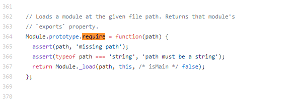
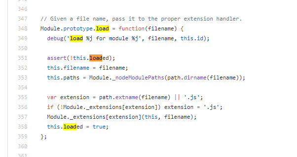
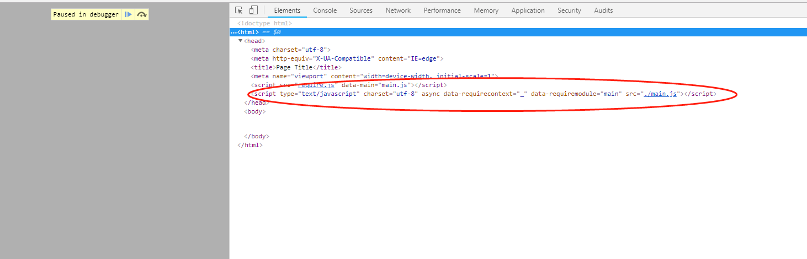

随着 JavasScript 语言逐渐发展，JavaScript 应用从简单的表单验证，到复杂的网站交互，再到服务端，移动端，PC 客户端的语言支持。JavaScript 应用领域变的越来越广泛，工程代码变得越来越庞大，代码的管理变得越来越困难，于是乎 JavaScript 模块化方案在社区中应声而起，其中一些优秀的模块化方案，逐渐成为 JavaScript 的语言规范，下面我们就 JavaScript 模块化这个话题展开讨论，本文的主要包含以几部分内容。

- 什么是模块
- 为什么需要模块化
- JavaScript 模块化之 CommonJS
- JavaScript 模块化之 AMD
- JavaScript 模块化之 CMD
- JavaScript 模块化之 ES Module
- 总结

## 什么是模块

模块，又称构件，是能够单独命名并独立地完成一定功能的程序语句的集合 (即程序代码和数据结构的集合体)。它具有两个基本的特征：外部特征和内部特征。外部特征是指模块跟外部环境联系的接口 (即其他模块或程序调用该模块的方式，包括有输入输出参数、引用的全局变量) 和模块的功能，内部特征是指模块的内部环境具有的特点 (即该模块的局部数据和程序代码)。简而言之，模块就是一个具有独立作用域，对外暴露特定功能接口的代码集合。

## 为什么需要模块化

首先让我们回到过去，看看原始 JavaScript 模块文件的写法。

```javascript
// add.js
function add(a, b) {
  return a + b;
}
// decrease.js
function decrease(a, b) {
  return a - b;
}

// formula.js
function square_difference(a, b) {
  return add(a, b) * decrease(a, b);
}
```

上面我们在三个 JavaScript 文件里面，实现了几个功能函数。其中，第三个功能函数需要依赖第一个和第二个 JavaScript 文件的功能函数，所以我们在使用的时候，一般会这样写：

```html
<html lang="en">
<head>
  <meta charset="UTF-8">
  <meta name="viewport" content="width=device-width, initial-scale=1.0">
  <meta http-equiv="X-UA-Compatible" content="ie=edge">
  <title>Document</title>
</head>
<body>
    <script src="add.js"></script>
    <script src="decrease.js"></script>
    <script src="formula.js"></script>
    <!--使用-->
    <script>
       var result = square_difference(3, 4);
    </script>
</body>
</html>
```

这样的管理方式会造成以下几个问题：

- 模块的引入顺序可能会出错
- 会污染全局变量
- 模块之间的依赖关系不明显

基于上述的原因，就有了对上述问题的解决方案，即是 JavaScript 模块化规范，目前主流的有 CommonJS，AMD，CMD，ES6 Module 这四种规范。

## Javascript 模块化之 CommonJS

CommonJS 规范的主要内容有，一个单独的文件就是一个模块。每一个模块都是一个单独的作用域，模块必须通过 module.exports 导出对外的变量或接口，通过 require() 来导入其他模块的输出到当前模块作用域中，下面讲述一下 NodeJs 中 CommonJS 的模块化机制。

### 1. 使用方式

```javascript
// 模块定义 add.js
module.eports.add = function(a, b) {
  return a + b;
};

// 模块定义 decrease.js
module.exports.decrease = function(a, b) {
  return a - b;
};

// formula.js,模块使用，利用 require() 方法加载模块,require 导出的即是 module.exports 的内容
const add = require("./add.js").add;
const decrease = require("./decrease.js").decrease;
module.exports.square_difference = function(a, b) {
  return add(a, b) * decrease(a, b);
};
```

### 2. exports 和 module.exports

exports 和 module.exports 是指向同一个东西的变量，即是 module.exports = exports = {}，所以你也可以这样导出模块

```javascript
//add.js
exports.add = function(a, b) {
  return a + b;
};
```

但是如果直接修改 exports 的指向是无效的，例如:

```javascript
// add.js
exports = function(a, b) {
  return a + b;
};
// main.js
var add = require("./add.js");
```

此时得到的 add 是一个空对象，因为 require 导入的是，对应模块的 module.exports 的内容，在上面的代码中，虽然一开始 exports = module.exports，但是当执行如下代码的时候，其实就将 exports 指向了 function,而 module.exports 的内容并没有改变，所以这个模块的导出为空对象。

```javascript
exports = function(a, b) {
  return a + b;
};
```

### 3. CommonJS 在 NodeJs 中的模块加载机制

以下根据 [NodeJs 中 CommonJS 模块加载源码](https://github.com/nodejs/node/blob/master/lib/internal/modules/cjs/loader.js) 来分析 NodeJS 中模块的加载机制。

在 NodeJs 中引入模块 (require)，需要经历如下 3 个步骤：

1. 路径分析
2. 文件定位
3. 编译执行

与前端浏览器会缓存静态脚本文件以提高性能一样，NodeJs 对引入过的模块都会进行缓存，以减少二次引入时的开销。不同的是，浏览器仅缓存文件，而在 NodeJs 中缓存的是编译和执行后的对象。

#### 3.1 路径分析 + 文件定位

其流程如下图所示：


#### 3.2 模块编译

在定位到文件后，首先会检查该文件是否有缓存，有的话直接读取缓存，否则，会新创建一个 Module 对象，其定义如下：

```javascript
function Module(id, parent) {
  this.id = id; // 模块的识别符，通常是带有绝对路径的模块文件名。
  this.exports = {}; // 表示模块对外输出的值
  this.parent = parent; // 返回一个对象，表示调用该模块的模块。
  if (parent && parent.children) {
    this.parent.children.push(this);
  }
  this.filename = null;
  this.loaded = false; // 返回一个布尔值，表示模块是否已经完成加载。
  this.childrent = []; // 返回一个数组，表示该模块要用到的其他模块。
}
```

生成对象后设置缓存，会执行指定的处理函数，如下所示：



接下来是解析模块路径，判断是否有缓存，然后生成 Module 对象：

```javascript
Module._load = function(request, parent, isMain) {
  if (parent) {
    debug("Module._load REQUEST %s parent: %s", request, parent.id);
  }

  // 解析文件名
  var filename = Module._resolveFilename(request, parent, isMain);

  var cachedModule = Module._cache[filename];

  // 判断是否有缓存，有的话返回缓存对象的 exports
  if (cachedModule) {
    updateChildren(parent, cachedModule, true);
    return cachedModule.exports;
  }

  // 判断是否为原生核心模块，是的话从内存加载
  if (NativeModule.nonInternalExists(filename)) {
    debug("load native module %s", request);
    return NativeModule.require(filename);
  }

  // 生成模块对象
  var module = new Module(filename, parent);

  if (isMain) {
    process.mainModule = module;
    module.id = ".";
  }

  // 缓存模块对象
  Module._cache[filename] = module;

  // 加载模块
  tryModuleLoad(module, filename);

  return module.exports;
};
```

tryModuleLoad 的代码如下所示：

```javascript
function tryModuleLoad(module, filename) {
  var threw = true;
  try {
    // 调用模块实例load方法
    module.load(filename);
    threw = false;
  } finally {
    if (threw) {
      // 如果加载出错，则删除缓存
      delete Module._cache[filename];
    }
  }
}
```

模块对象执行载入操作 module.load 代码如下所示：



在这里同步读取模块，再执行编译操作：


编译过程主要做了以下的操作：

1. 将 JavaScript 代码用函数体包装，隔离作用域，例如：

```javascript
  exports.add = function(a, b) {
    return a + b;
  }

  // 会被包装成
  (function(exports, require, modules, __filename, __dirname) {
    exports.add = function(a, b) {
      return a + b;
    };
  })
```

2. 执行函数，注入模块对象的 exports 属性，require 全局方法，以及对象实例，**filename, **dirname，然后执行模块的源码。

3. 返回模块对象 exports 属性。

## JavaScript 模块化之 AMD

AMD, Asynchronous Module Definition，即异步模块加载机制，它采用异步方式加载模块，模块的加载不影响它后面语句的运行。所有依赖这个模块的语句都定义在一个回调函数中，等到依赖加载完成之后，这个回调函数才会运行。

AMD 的诞生，就是为了解决这两个问题：

1. 实现 JavaScript 文件的异步加载，避免网页失去响应
2. 管理模块之间的依赖性，便于代码的编写和维护

```javascript
 // 模块定义
 define(id?: String, dependencies?: String[], factory: Function|Object);
```

id 是模块的名字，它是可选的参数。

dependencies 指定了所要依赖的模块列表，它是一个数组，也是可选的参数。每个依赖的模块的输出都将作为参数一次传入 factory 中。如果没有指定 dependencies，那么它的默认值是 ["require", "exports", "module"]。

factory 是最后一个参数，它包裹了模块的具体实现，它是一个函数或者对象。如果是函数，那么它的返回值就是模块的输出接口或值，如果是对象，此对象应该为模块的输出值。

举个例子

```javascript
// 模块定义，add.js
define(function() {
  let add = function(a, b) {
    return a + b;
  };
  return add;
});

// 模块定义，decrease.js
define(function() {
  let decrease = function(a, b) {
    return a - b;
  };
  return decrease;
});

// 模块定义，square.js
define(["./add", "./decrease"], function(add, decrease) {
  let square = function(a, b) {
    return add(a, b) * decrease(a, b);
  };
  return square;
});

// 模块使用，主入口文件 main.js
require(["square"], function(math) {
  console.log(square(6, 3));
});
```

这里用实现了 AMD 规范的 RequireJS 来分析，RequireJS 源码较为复杂，这里只对异步模块加载原理做一个分析。在加载模块的过程中， RequireJS 会调用如下函数：

```javascript
/**
 *
 * @param {Object} context the require context to find state.
 * @param {String} moduleName the name of the module.
 * @param {Object} url the URL to the module.
 */
req.load = function(context, moduleName, url) {
  var config = (context && context.config) || {},
    node;
  // 判断是否为浏览器
  if (isBrowser) {
    // 根据模块名称和 url 创建一个 Script 标签
    node = req.createNode(config, moduleName, url);

    node.setAttribute("data-requirecontext", context.contextName);
    node.setAttribute("data-requiremodule", moduleName);

    // 对不同的浏览器 Script 标签事件监听做兼容处理
    if (
      node.attachEvent &&
      !(
        node.attachEvent.toString &&
        node.attachEvent.toString().indexOf("[native code") < 0
      ) &&
      !isOpera
    ) {
      useInteractive = true;

      node.attachEvent("onreadystatechange", context.onScriptLoad);
    } else {
      node.addEventListener("load", context.onScriptLoad, false);
      node.addEventListener("error", context.onScriptError, false);
    }

    // 设置 Script 标签的 src 属性为模块路径
    node.src = url;

    if (config.onNodeCreated) {
      config.onNodeCreated(node, config, moduleName, url);
    }

    currentlyAddingScript = node;

    // 将 Script 标签插入到页面中
    if (baseElement) {
      head.insertBefore(node, baseElement);
    } else {
      head.appendChild(node);
    }
    currentlyAddingScript = null;

    return node;
  } else if (isWebWorker) {
    try {
      //In a web worker, use importScripts. This is not a very
      //efficient use of importScripts, importScripts will block until
      //its script is downloaded and evaluated. However, if web workers
      //are in play, the expectation is that a build has been done so
      //that only one script needs to be loaded anyway. This may need
      //to be reevaluated if other use cases become common.

      // Post a task to the event loop to work around a bug in WebKit
      // where the worker gets garbage-collected after calling
      // importScripts(): https://webkit.org/b/153317
      setTimeout(function() {}, 0);
      importScripts(url);

      //Account for anonymous modules
      context.completeLoad(moduleName);
    } catch (e) {
      context.onError(
        makeError(
          "importscripts",
          "importScripts failed for " + moduleName + " at " + url,
          e,
          [moduleName]
        )
      );
    }
  }
};

// 创建异步 Script 标签
req.createNode = function(config, moduleName, url) {
  var node = config.xhtml
    ? document.createElementNS("http://www.w3.org/1999/xhtml", "html:script")
    : document.createElement("script");
  node.type = config.scriptType || "text/javascript";
  node.charset = "utf-8";
  node.async = true;
  return node;
};
```

可以看出，这里主要是根据模块的 Url，创建了一个异步的 Script 标签，并将模块 id 名称添加到的标签的 data-requiremodule 上，再将这个 Script 标签添加到了 html 页面中。同时为 Script 标签的 load 事件添加了处理函数，当该模块文件被加载完毕的时候，就会触发 context.onScriptLoad。我们在 onScriptLoad 添加断点，可以看到页面结构如下图所示:



由图可以看到，Html 中添加了一个 Script 标签，这也就是异步加载模块的原理。

## JavaScript 模块化之 CMD

CMD (Common Module Definition) 通用模块定义，CMD 在浏览器端的实现有 SeaJS， 和 RequireJS 一样，SeaJS 加载原理也是动态创建异步 Script 标签。二者的区别主要是依赖写法上不同，AMD 推崇一开始就加载所有的依赖，而 CMD 则推崇在需要用的地方才进行依赖加载。

```javascript
// ADM 在执行以下代码的时候，RequireJS 会首先分析依赖数组，然后依次加载，直到所有加载完毕再执行回到函数
define(["add", "decrease"], function(add, decrease) {
  let result1 = add(9, 7);
  let result2 = decrease(9, 7);
  console.log(result1 * result2);
});

// CMD 在执行以下代码的时候， SeaJS 会首先用正则匹配出代码里面所有的 require 语句，拿到依赖，然后依次加载，加载完成再执行回调函数
define(function(require) {
  let add = require("add");
  let result1 = add(9, 7);
  let add = require("decrease");
  let result2 = decrease(9, 7);
  console.log(result1 * result2);
});
```

## JavaScript 模块化之 ES Module

ES Module 是在 ECMAScript 6 中引入的模块化功能。模块功能主要由两个命令构成，分别是 export 和 import。export 命令用于规定模块的对外接口，import 命令用于输入其他模块提供的功能。

其使用方式如下:

```javascript
// 模块定义 add.js
export function add(a, b) {
  return a + b;
}

// 模块使用 main.js
import { add } from "./add.js";
console.log(add(1, 2)); // 3
```

下面讲述几个较为重要的点。

### 1. export 和 export default

在一个文件或模块中，export 可以有多个，export default 仅有一个, export 类似于具名导出，而 default 类似于导出一个变量名为 default 的变量。同时在 import 的时候，对于 export 的变量，必须要用具名的对象去承接，而对于 default，则可以任意指定变量名，例如：

```javascript
// a.js
 export var a = 2;
 export var b = 3 ;
// main.js 在导出的时候必须要用具名变量 a, b 且以解构的方式得到导出变量
import {a, b} from 'a.js' // √ a= 2, b = 3
import a from 'a.js' // x

// b.js export default 方式
const a = 3
export default a // 注意不能 export default const a = 3 ,因为这里 default 就相当于一个变量名

// 导出
import b form 'b.js' // √
import c form 'b.js' // √ 因为 b 模块导出的是 default，对于导出的default，可以用任意变量去承接
```

### 2. ES Module 模块加载和导出过程

以如下代码为例子：

```javascript
 // counter.js
 export let count = 5

 // display.js
 export function render() {
   console.log('render')
 }
 // main.js
 import { counter } from './counter.js';
 import { render } from './display.js'
 ......// more code
```

在模块加载模块的过程中，主要经历以下几个步骤：

#### 2.1 构建 (Construction)

这个过程执行查找，下载，并将文件转化为模块记录 (Module record)。所谓的模块记录是指一个记录了对应模块的语法树，依赖信息，以及各种属性和方法 (这里不是很明白)。同样也是在这个过程对模块记录进行了缓存的操作，下图是一个模块记录表：

  

下图是缓存记录表：

  

#### 2.2 实例化 (Instantiation)

这个过程会在内存中开辟一个存储空间 (此时还没有填充值)，然后将该模块所有的 export 和 import 了该模块的变量指向这个内存，这个过程叫做链接。其写入 export 示意图如下所示：

  

然后是链接 import，其示意图如下所示：

  

#### 2.3 赋值(Evaluation)

这个过程会执行模块代码，并用真实的值填充上一阶段开辟的内存空间，此过程后 import 链接到的值就是 export 导出的真实值。

根据上面的过程我们可以知道。ES Module 模块 export 和 import 其实指向的是同一块内存，但有一个点需要注意的是，import 处不能对这块内存的值进行修改，而 export 可以，其示意图如下：


## 总结

本文主要对目前主流的 JavaScript 模块化方案 CommonJs，AMD，CMD, ES Module 进行了学习和了解，并对其中最有代表性的模块化实现 (NodeJs，RequireJS，SeaJS，ES6) 做了一个简单的分析。对于服务端的模块而言，由于其模块都是存储在本地的，模块加载方便，所以通常是采用同步读取文件的方式进行模块加载。而对于浏览器而言，其模块一般是存储在远程网络上的，模块的下载是一个十分耗时的过程，所以通常是采用动态异步脚本加载的方式加载模块文件。另外，无论是客户端还是服务端的 JavaScript 模块化实现，都会对模块进行缓存，以此减少二次加载的开销。最后再对几种规范的做一个简单的表格对比。

| 模块化方案 | 加载方式  | 适用端          | 何时加载 |
| ---------- | --------- | --------------- | -------- |
| CommonJS   | 同步      | 服务端          | 运行时   |
| AMD        | 异步      | 浏览器          | 运行时   |
| CMD        | 异步      | 浏览器          | 运行时   |
| ES Module  | 异步/同步 | 服务端/浏览器端 | 编译时   |

参考文章:
[ES modules: A cartoon deep-dive](https://hacks.mozilla.org/2018/03/es-modules-a-cartoon-deep-dive/)
