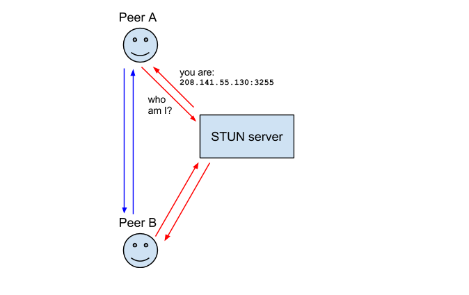

### WebRTC入门

### 1.背景
  &nbsp;&nbsp;&nbsp;&nbsp;webRTC是Google在2010年收购GIP公司之后获得的一项技术。它提供了音视频的采集、处理(降噪，回声消除等)、编解码、传输等技术,webRTC的目标是实现无需安装任何插件就可以通过浏览器进行P2P的实时音视频通话及文件传输，目前webRCT被纳入万维网联盟的W3C推荐标准。

  WebRTC 主要由两个组织来制定。  
  - Web Real-Time Communications (WEBRTC) W3C 组织：定义浏览器 API
  - Real-Time Communication in Web-browsers (RTCWEB) IETF 标准组织：定义其所需的协议，数据，安全性等手段。


### 2.基本结构和基本原理
  其结构图如下所示：  
    
  &nbsp;&nbsp;&nbsp;&nbsp;有图可知，webRTC底层用C++编写，在上一层用javascript做了封装，所以webRTC既适用于浏览器端，也可以通过调用C++层的native code进行移动端的开发。

  webRTC原理图如下所示:   
    
  &nbsp;&nbsp;&nbsp;&nbsp;webRTC中，客户端的之间的媒体流的数据传输是点对点的，也就说所谓的P2P传输。但是webRTC并非完全不需要服务器，对于流媒体传输通道构建之前，通信的双方需要进行数据协商，如初始化通信的session信息，公网iP地址和端口号，视频分辨率，编解码格式，流媒体数传输开始和结束控制，这些都是需要服务器来参与的，webRTC没有规定这些信息传输的机制，XHR、webSocket、Socket.io等都是可以的，这个中转元数据的服务器叫做信令服务器。

### 3.关于点对点传输(P2P)的基础知识
 &nbsp;&nbsp;&nbsp;&nbsp; webRTC中，点对点的传输的建立是一个较为复杂也是较为基础的过程，在webRTC中，使用的是ICE(Interactive Connectivity Establishment)框架，ICE是一种综合性的**NAT穿越技术**，它整合了**STUN**、**TURN**,后面会依次介绍这几个概念。

1. NAT  
&nbsp;&nbsp;&nbsp;&nbsp;NAT,Network Address Translation,即网络地址转换，接入广域网(WAN)技术,是一种将私有(保留)地址转化为合法IP地址的转换技术。NAT地解决了可以很好得解决lP地址不足的问题，而且还能够有效地避免来自网络外部的攻击，隐藏并保护网络内部的计算机。但是，这个对于大多数的p2p连接而言，这是不友好的。原因是因为在大多数的情况下，想要进行P2P连接的客户端一般都是位于NAT的后面，如果没有中间服务器的帮助，双方是无法直接建立P2P连接的，所以就有了NAT穿越，在讲NAT穿越之前，我们先来了解NAT的工作过程。

2. NAT工作过程  
NAT本质上就是一个ip映射表，将内网的ip地址映射到公网的ip地址,其大致原理入下图所示。  
  
&nbsp;&nbsp;&nbsp;&nbsp;因为内网地址的数据报文不会被公网的路由器转发，所以当某内网设置想要请求外网数据时，会将请求报文发送到NAT设备，NAT设备通过在映射表找到该内网设备所对应的公网ip地址，然后将数据报文的源ip修改未对应的这个公网ip，以此来和外部设备通信。同样，在外部设备应答的时候，NAT设备也会通过映射表，找到响应报文目的ip对应的内网ip，让后将目的ip从公网ip修改为内网ip，再将响应报文发回内部。  
&nbsp;&nbsp;&nbsp;&nbsp;所以，我们要想实现p2p通信，得到对方的内网地址对应的公网地址是一个重要的必须前提，只有得到对应的公网地址，才有可能和对方建立P2P连接，而这个过程，也就是所谓的NAT穿透。注意，我这里用的是可能，因为对于NAT设置后的客户端而言，得到其公网ip和端口只是建立建立的必要而不充分条件，因为NAT有多种类型，每种类型的特性又有一些区别，下面，我们先了解一下NAT类型。  

3. NAT类型及其特性  
  - 完全锥形NAT(Full Cone NAT):  
  &nbsp;&nbsp;&nbsp;&nbsp;所有从同一个内网IP和端口号发送过来的请求都会被映射成同一个外网IP和端口号，并且任何一个外网主机都可以通过这个映射的外网IP和端口号向这台内网主机发送包。  

  - 限制锥形NAT(Restricted Cone NAT):  
  &nbsp;&nbsp;&nbsp;&nbsp;它也是所有从同一个内网IP和端口号发送过来的请求都会被映射成同一个外网IP和端口号。与完全锥形不同的是，外网主机只能够向先前已经向它发送过数据包的内网主机发送包。  

  - 端口限制锥形NAT(Port Restricted Cone NAT):  
  &nbsp;&nbsp;&nbsp;&nbsp;与限制锥形NAT很相似，只不过它包括端口号。也就是说，一台IP地址X和端口P的外网主机想给内网主机发送包，必须是这台内网主机先前已经给这个IP地址X和端口P发送过数据包。  

  - 对称NAT(Symmetric NAT):  
   &nbsp;&nbsp;&nbsp;&nbsp;所有从同一个内网IP和端口号发送到一个特定的目的IP和端口号的请求，都会被映射到同一个IP和端口号。如果同一台主机使用相同的源地址和端口号发送包，但是发往不同的目的地，NAT将会使用不同的映射。此外，只有收到数据的外网主机才可以反过来向内网主机发送包。

4. NAT穿越  
&emsp;因为有了这些NAT设备，导致了P2P的连接变的异常困难，而穿过这些NAT设置，与内网设备建立p2p连接的过程，即称为NAT穿越(也就内网打洞)。


### 4.webRTC连接建立框架-ICE(交互式连接建立)
&emsp;由上面可知，由于NAT的存在，webRTC的p2p连接变得异常困难，甚至有可能连接失败，webRTC对于连接的建立和失败后的连接方案，制定了一套ICE(Interactive Connectivity Establishment)框架，ICE是一种综合性的NAT穿越技术，它整合了STUN、TURN。当穿越网络时。下图是ICE的架构图。  
  
其中用到了TURN服务和Relay服务(即是STUN),那么TURN和STUN到底是干嘛的？有什么作用呢？


### 5.ICE之STUN
&emsp;STUN(Session Traversal Utilities for NAT),NAT会话穿越应用程序，是个轻量级的协议，是基于UDP的完整的穿透NAT的解决方案。它允许应用程序发现它们与公共互联网之间存在的NAT和防火墙及其他类型。它也可以让应用程序确定NAT分配给它们的公网IP地址和端口号。
  
客户端通过和公网STUN服务进行通信，以此来判断自己是否在NAT后面以及自己的对应的公网地址和端口号，然后将这些信息通过信令服务器，发送给待连接的另一个的客户端。

### 6.ICE之TURN  
&emsp;TURN(Traversal Using Relays around NAT), NAT的中继穿越方式,通过TURN服务器中继所有数据的方式来绕过“对称型NAT”。你需要在TURN服务器上创建一个连接，然后告诉所有对端设备发包到服务器上，TURN服务器再把包转发给你。很显然这种方式是开销很大的，所以只有在没得选择的情况下采用。其图示如下:  
   
至于为何对称型NAT会无法连接，原因是对称型NAT,对于不同的目标ip和端口，NAT会映射成不同的公网ip和端口，而通过STUN得到的IP和端口，是特定与STUN服务的ip和端口。即使将这个ip和端口发送给另外一个待连接端，也是无法连接的。  
#### &emsp;综上，ICE其实就是一种探索式框架，如果无法建立直接的P2P连接，则会采用TURN做为中继服务来转发双方的通信数据。 

### 7.通过浏览器创建一个简单webRTC视频通信
&emsp;在开始写代码之前，我们首先来看一下，用webRTC创建一个浏览器端的视频通信的主要过程以及其中涉及到的api，其过程图如下所示:  
    
这里用firefox 浏览器进行测试，因为chrome浏览器需要再https的环境下才能使用，其客户端现代码如下所示: 
```html
<!doctype html>
<html lang="en">
<head>
  <meta charset="UTF-8">
  <meta name="viewport" content="width=device-width, initial-scale=1.0">
  <meta http-equiv="X-UA-Compatible" content="ie=edge">
  <title>Document</title>
</head>
<body>
  <div style="width: 500px; margin:50px auto">
    <video id="video" autoplay style="width: 500px; height: 300px; border: 1px solid"></video>
    <div>
      <input type="text" placeholder="请输入你的名字" id="name_input">
      <button onclick="chat()">开始连接</button>
    </div>
</div>
  <script src="https://cdnjs.cloudflare.com/ajax/libs/socket.io/2.1.1/socket.io.js"></script>
  <script src="./js/main.js"></script>
  <script>

    // 客户端代码
    var socket = io.connect('http://localhost:8081');
    let video = document.getElementById('video')
    let connection = null;
    let name = 'A' // 保存当前用户标识
    let offerCreated = false;
    socket.on('offerState', function(data) {
      offerCreated = data.offerCreated
    })

    // 监听对方ICE应答事件
    socket.on('swapcandidate', function(data) {
      console.log('swapcandidate', data);
      if (data.name !== name) {
        connection.addIceCandidate(data.candidate)
      }
    })
    let constraints = {
      video: true,
      audio: false
    }
    function chat() {
      name = document.getElementById('name_input').value;
      console.log('name', name)
        //获取媒体流
      navigator.mediaDevices.getUserMedia(constraints).then(function(stream) {
        connection = getRCTPeerConnection();
        connection.onicecandidate = handleicecandidate
        // 发送媒体设备拿到的数据流
        connection.addStream(stream);
        
        // 监听对方媒体流到来事件
        connection.onaddstream = function(stream) {
          console.log('收到媒体流', stram);
          // 将媒体流写入video中
          video.srcObject = stream;
        }
        // 创建媒体描述对象
        socket.on('answer', function(data) {
          console.log('收到应答answer', data);
          connection.setRemoteDescription(RTCSessionDescription(data.sdp))
        })
        connection.createOffer().then(function(offer){
          console.log('createOffer', offer)
          connection.setLocalDescription(offer).then(function() {
            console.log('发送offer', offer)
            // 将媒体协商信息发给对方
            socket.emit('offer', {
              name: name,
              sdp: connection.localDescription
            })
          }).catch(function(err) {
            console.log('setLocalDescription error', e);
          })
          }).catch(function(e) {
          console.log('createOffer error', e);
        })
      }).catch(function(err) {
        console.log('获取媒体流出错', err);
      })
    }
  // 构建连接对像
  function getRCTPeerConnection() {
    var ice = {
        "iceServers": [
          { "url": "stun:stun.l.google.com:19302" }, //使用google公共测试服务器
        ]
      };
    let connection =  new RTCPeerConnection(ice);
    return connection;
  }
  
  // 处理ice信息到来事件，即是通过TURN的带自己的ip信息
  function handleicecandidate(event) {
    // 将这些信息发送给对方
    socket.emit('swapcandidate', {
      name: name,
      candidate: event.candidate
    })
  }
  </script>
</body>
</html>
``` 
服务端代码(信令服务器): 服务端主要是用于交换双方的协商数据。
```javascript
var express = require('express');
var app = express();
var http = require("http");
var server=http.createServer(app);
var fs = require('fs');
var path = require('path')
var iceCanditate = [];
var offerUsers = [];
const expressSrver = app.listen(8081, function() {
  console.log('server running on localhost:8081')
});
var io = require('socket.io')(expressSrver);

app.all('*', function(req, res, next) {
  res.header("Access-Control-Allow-Origin", "*");
  next();
})
app.use(function(req, res) {
  fs.readFile(__dirname + `/${req.path}.html`, function(err, data) {
    res.writeHead(200)
    res.end(data);
  })
})
io.origins('*:*');
io.on('connection', function (socket) {
  // 收到A的描述信息，转发给B
  socket.on('offer', function (data) {
    if (offerUsers.includes(data.name)) return;
    console.log('服务端收到offer包', data)
    io.sockets.emit('offer', data)
    offerUsers.push(data.name);
  });

  // 收到ICE信息
  socket.on('swapcandidate', function(data) {
    if (iceCanditate.includes(data.name)) {
      return;
    }
    console.log('服务端 收到ICE包', data)
    io.sockets.emit('swapcandidate', data)
    iceCanditate.push(data.name);
  })

  socket.on('answer', function(data) {
    io.sockets.emit('answer', data)
  })
});
```
### 8.结束语
&emsp;webRTC提供了底层的媒体通信api，可以让我们更方便快捷地再网络中传递大量的媒体数据，再如今网络快速发展的当下，我们有理由相信未来webRTC将会被更多的应用。


### 参考文章
[P2P技术之STUN、TURN、ICE详解](http://www.52im.net/thread-557-1-1.html)  
[深入理解WebRTC](https://segmentfault.com/a/1190000011403597)  
[webRTC——浏览器里的音视频通话](https://segmentfault.com/a/1190000011767066)  
[WebRTC协议](https://developer.mozilla.org/zh-CN/docs/Web/API/WebRTC_API/Protocols)


 