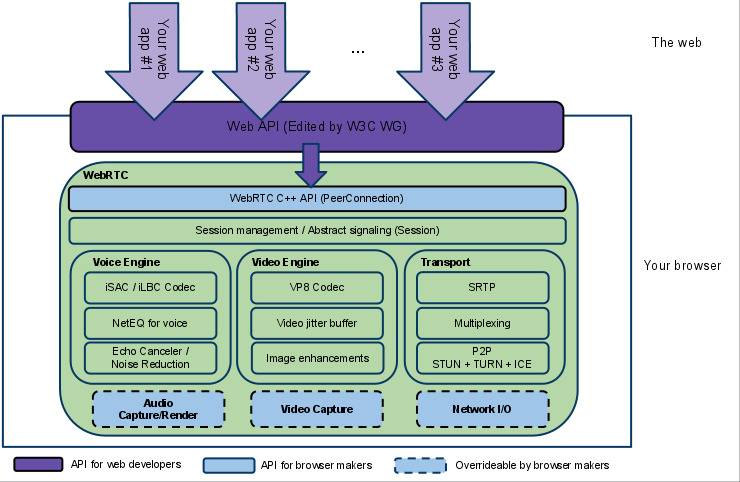

### WebRCT入门

### 1.背景
  &nbsp;&nbsp;webRTC是Google在2010年收购GIP公司之后获得的一项技术。它提供了音视频的采集、处理(降噪，回声消除等)、编解码、传输等技术,webRTC的目标是实现无需安装任何插件就可以通过浏览器进行P2P的实时音视频通话及文件传输，目前webRCT被纳入万维网联盟的W3C推荐标准。

  WebRTC 主要由两个组织来制定。  
  - Web Real-Time Communications (WEBRTC) W3C 组织：定义浏览器 API
  - Real-Time Communication in Web-browsers (RTCWEB) IETF 标准组织：定义其所需的协议，数据，安全性等手段。

### 2.基本结构和基本原理
  &nbsp;&nbsp;其结构图如下所示：  
    
  &nbsp;&nbsp;有图可知，webRCT底层用C++编写，在上一层用javascript做了封装，所以webRCT既适用于浏览器端，也可以通过调用C++层的native code进行移动端的开发。

  &nbsp;&nbsp;webRCT原理图如下所示:   
    
  &nbsp;&nbsp; webRCT中，客户端的之间的媒体流的数据传输是点对点的，也就说所谓的P2P传输。但是webRCT并非完全不需要服务器，对于流媒体传输通道构建之前，通信的双方需要进行数据协商，如初始化通信的session信息，双方的ip、端口，视频分辨率，编解码格式，流媒体数传输开始和结束控制，这些都是需要服务器来参与的，webRTC没有规定这些信息传输的机制，XHR、webSocket、Socket.io等都是可以的。

### 3.关于点对点传输(P2P)的基础知识
 &nbsp;&nbsp; webRCT中，点对点的传输的建立是一个较为复杂也是较为基础的过程，在webRCT中，使用的是ICE(Interactive Connectivity Establishment)框架，ICE是一种综合性的**NAT穿越技术**，它整合了**STUN**、**TURN**,下面来依次介绍一下这几个概念。

1. NAT  
&nbsp;&nbsp;NAT,Network Address Translation,即网络地址转换，接入广域网(WAN)技术,是一种将私有(保留)地址转化为合法IP地址的转换技术。NAT地解决了可以很好得解决lP地址不足的问题，而且还能够有效地避免来自网络外部的攻击，隐藏并保护网络内部的计算机。但是，这个对于大多数的p2p连接而言，这是不友好的。原因是因为在大多数的情况下，想要进行P2P连接的客户端一般都是位于NAT的后面，如果没有中间服务器的帮助，双方是无法直接建立P2P连接的，所以就有了NAT穿越，在将NAT穿越之前，我们先来了解NAT的工作过程。

2. NAT工作过程  
&nbsp;&nbsp;NAT本质上就是一个ip映射表，将内网的ip地址映射到公网的ip地址

 