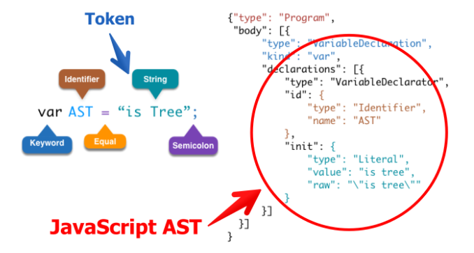
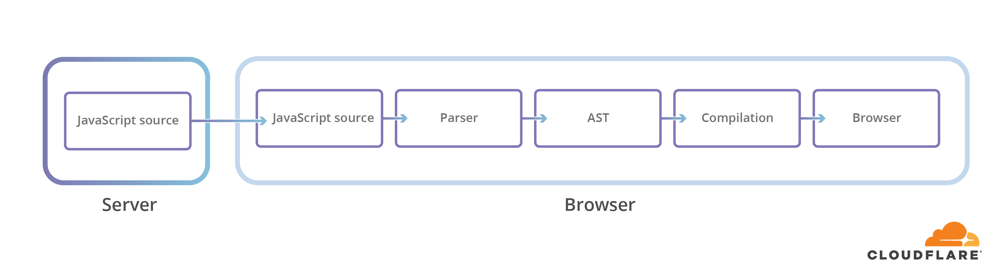
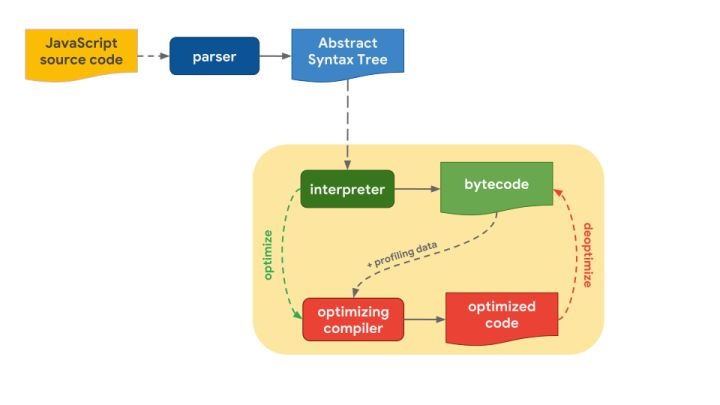
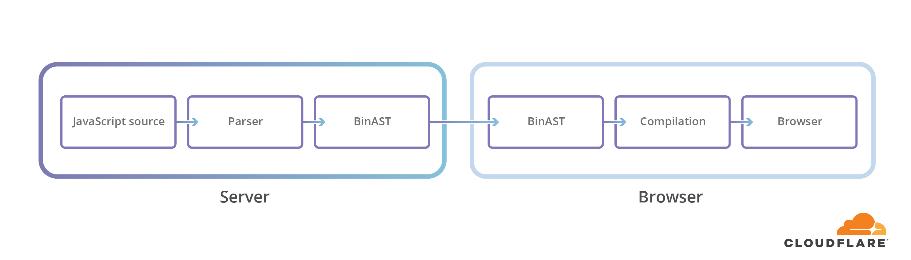
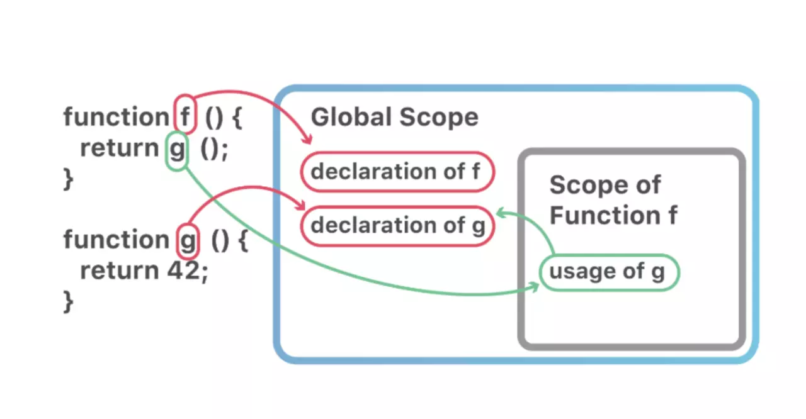
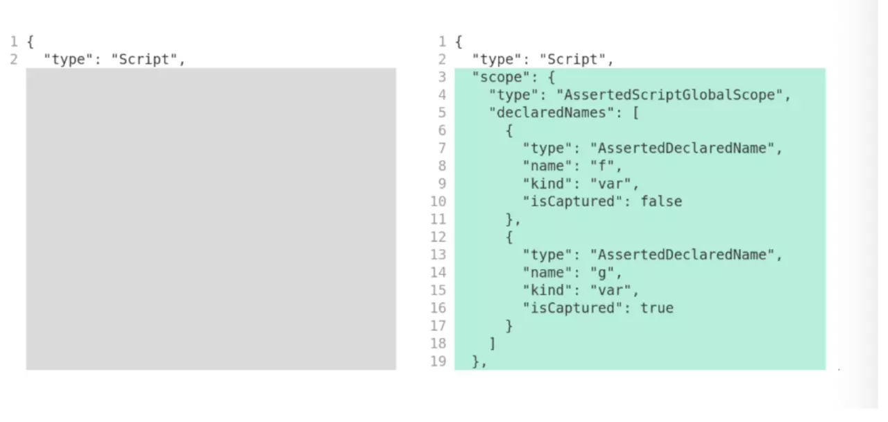

## BinaryAST 加快 JavaScript 解析

### 1. 文章概述
-  从 JavaScript 冷启动讲起
- 二进制语法树提案 (BinaryAST Proposal)
- JavaScript 解析过程
- 优点1 - 加快网络传输速度
- 优点2 - 加快作用域查找
- 优点3 - 解析过程明确
- 例子展示
- BinaryAST 现状
- 总结


### 1. JavaScript AST
在进入正题之前，我们先来了解一下什么是 AST， AST, Abstract Syntax Tree 抽象语法树，简称语法树，指代码在计算机内存的一种树状数据结构，便于计算机理解和阅读,也就是说，一种编程语言的源代码，通过构建语法树的形式将源代码中的语句映射到树中的每一个节点上,如下图是 JavaScript 的一个语句和 AST 的映射关系：  

 

对于一些源代码的更改需求，我们可以更改(增加，删除，替换) AST,然后将 AST 重新生成源代码，实现代码的灵活更改，这也是 AST 可以用来做 IDE插件(如代码语法检查，代码风格检查，代码的格式化，代码高亮，代码错误), 转换代码的工具，代码的混淆压缩重要原因。


### 1. 从 JavaScript 冷启动讲起
在目前的 Web 应用中，应用程序启动时间已经逐渐成为性能上的瓶颈，对于一些富交互型，往往需要大量的 JavaScript 代码。下面表格为部分 Web 应用的 JavaScript 资源大小：  

| Web App (Desktop) | Uncompressed JS Size |
| ----------------- | -------------------- |
| LinkedIn          | 7.2 MB               |
| Facebook          | 7.1 MB               |
| Google Sheets     | 5.8 MB               |
| Gmail             | 3.9 MB               |
| Yahoo             | 3.4 MB               |  


| Web App (Mobile) | Uncompressed JS Size |
| ---------------- | -------------------- |
| LinkedIn         | 6.2 MB               |
| YouTube          | 1.9 MB               |
| Twitter          | 1.8 MB               |
| Facebook         | 1.8 MB               |
| Reddit           | 1.3 MB               |

在上述表格中,我们可以看出，对于富交互型的 Web 应用，JavaScirpt 资源未压缩时的大小基本都超过 1 MB,而随着应用程序的复杂性增加，需要加载的 JavaScript 资源更多。虽然缓存有所帮助，但热门应用程序站点会定期发布新代码，这使得冷启动（首次加载）时间变得尤为重要。

通常而言，在冷启动性能的影响因素中，最重要的是资源的下载速度，然而在目前大多数的复交互型的应用中，影响冷启动性能的一个很大因素是 JavaScript 解析时间。在开始执行代码之前，JavaScript 引擎首先需要解析下载的代码，确保里面没有包含语法错误，然后将其编译成初始字节码，随着网速速度的加快，解析和编译将成为影响冷启动性能的主要因素。下图为 Web应用程序执行流程:  

  

如果是较差的设备的话，执行时间会更长

  

设备的性能（CPU或内存性能）是JavaScript 解析时间差异中最重要的因素也是应用程序启动的时间长短的重要因素。


### 2. 二进制语法树提案 (BinaryAST Proposal)
从上述的内容中，我们知道 JavaScript 的解析俨然成为 Web 应用的性能瓶颈之一，而这也是二进制语法树 (BinaryAST) 的由来。BinaryAST 是 Mozilla 提出并积极开发的一种新的在线 JavaScript 格式，旨在加快解析速度，同时保持原始 JavaScript 的语义不变。它的实现方式是：*使用有效的二进制来表示代码和数据结构，并且存储和提供额外的信息来提前指导解析器工作* 简单的说就是用二进制的来表示源码。下面就来讲述一下 BinaryAST 是如何提升解析速度的，在这之前我们先来看看 JavaScript 的解析过程。


### 注，下文中讲述涉及的 JavaScript 引擎中，  v8 的 5.9 版本之前是不会转化为字节码的，而是直接转换为本地码。在 5.9 版本中，新增了一个 Ignition 字节码解释器，将默认启动


### 3. JavaScript 解析过程

对于要在浏览器中执行的常规 JavaScript 代码，源代码被解析为一个称为 AST 的中间表示，它描述了代码的语法结构。然后，可以将此 AST(AST，abstract syntax tree 抽象语法树，是源代码的抽象语法结构的树状表现形式，这里特指编程语言的源代码) 编译为字节码或机器码以供执行, 其示意图如下：  

  

也就是说，浏览器加载执行 JavaScript 都会经过如下图所示的步骤：  

  
 

解析 JavaScript 不是一项简单的任务，无论使用哪种优化，它仍然需要逐字符读取整个文本文件，同时跟踪额外的上下文进行语法分析。


BinaryAST 的目标是通过在解析器需要的时间和地点提供额外的信息和上下文，来降低复杂性和浏览器解析器必须完成的总体工作量。

要执行以 BinaryAST 方式传递的 JavaScript，所需要的唯一步骤是： 

  


BinaryAST 的另一个好处是它可以只解析启动所需的关键代码，完全跳过未使用的位， 这可以显著提高初始加载时间。  

   

  

上述内容大概讲述了 BinaryAST 大方向是优化 JavaScript 解析速度的方式，接下来我们来看看 BinaryAST 具体是有那些方面的优势。


### 优点1 - 加快网络传输速度

由上述的内容，我们可以知道，BinaryAST 采用的是 二进制 AST 的形式来表现 JavaScript 的，传统的现用的 JavaScript 是采用文本的格式进行网络的传输的
，而采用 BinaryAST 是以二进制的数据格式进行传输的，其速度毫无疑问会快于文本传输，虽然如今网络的速度是越来越快，但是 BinaryAST 的方式在传输方面还是有一定的优势的。


### 优点2 - 加快作用域查找

二进制 AST 源码相当于文本的源码，并不是一个新的语言，也不是 JavaScript 的子集或超集，它是 JavaScript。它不是一个字节码，而是源代码的二进制表示形式。如果您愿意，这个二进制 AST 就是一种专为 JavaScript 而设计的，并为了解析速度而优化过的源代码，BinaryAST 在将 JavaScript 转化为二进制的同时会保存一些额外的信息，来提前指导解析器工作，而作用域信息的存储就是其中一个。

来看一个例子：   

```javascript
function f() {
	return g();
}

function g() {
	return 42;
}
f()
```

在普通的 JavaScript 执行过程中，这段代码在浏览器中会被首先逐个字符的读取代码文件，进行分词，然后进行句法解析生成 AST, JavaScript 引擎会将生成的 AST 输入到 JavaScript 解释器中，然后解释器将根据 AST 生成可执行的字节码并执行。

当 JavaScript 解析器将 AST 转化为字节码的时候，其中会涉及到变量的查找，即是作用域链的查找过程。解析器会从最近的作用域开始查找，如果没找到，就会往上一级作用域查找，直到全局作用域。在上述的例子中，当解析器将 AST 转化为字节码并执行的时候，解析器查看 F 的主体时，它还不知道 G 指的是什么——它可能是一个已经存在的全局函数或者在同一个文件中进一步声明的某个函数——所以它无法最终解析原始函数并开始实际编译，而需要顺着作用域往上查找，直到全局作用域环境。

而 BinaryAST 通过存储所有作用域信息，可以直接查找作用域信息定位到指定的作用域，从而减少作用域查找的时间。  
 

   


用 JSON 表示初始的 AST 和增强的 AST 之前的区别，如下图所示：  

   


### 优点3 加快解析过程
在编程语言中使用文本格式对于可读性和调试是很好的，但它并不是解析和执行的最有效的表示形式


另一个问题是语法本身的歧义。这在 ES5 世界中已经是一个问题，但通常可以通过一些基于以前看到的标记的额外记录来解决。然而，在 ES6+ 中，有些东西可能一直模糊不清，直到它们被完全解析为止。

例如，一个标记序列如下：  

```javascript
(a, {b: c, d}, [e = 1])...
```

上述标记序列可以是一个用嵌套的对象和数组文本以及赋值来启动带括号的逗号表达式：

```javascript
(a, {b: c, d}, [e = 1]); // 这是一个表达式
```

也可以是一个带有嵌套对象和数组模式的箭头表达式函数的参数列表和默认值：

```javascript
(a, {b: c, d}, [e = 1]) => … // 这是一个参数列表
```

这两种表示都是完全有效的，但语义完全不同，在看到最后一个标记之前，你无法知道要处理的是哪个。
为了解决这一问题，解析器在解析为 AST 的过程中，解析器通常要么回溯，这很容易以指数级的速度变慢，要么将内容解析为能够同时保存表达式和模式的中间节点类型，并进行后续的转换。后一种方法保留了线性性能，但使实现更加复杂，需要保留更多的状态。

在 BinaryAST 格式下，这个问题不再存在。因为 BinaryAST 有额外的数据标明节点的类型，所以解析器可以直接根据类型来解析。


### BinaryAST 现状
BinaryAST 已经作为 Stage 1 Proposal 被 ECMA TC-39 所接受。


### 总结
BinaryAST是原始JavaScript代码和相关数据结构的二进制表示形式，用于在页面加载时与JavaScript源代码本身相比加快代码的解析速度。二进制抽象语法树格式应该能够加快所有web设备上的脚本加载速度。与解析传统JavaScript源代码相比，CloudFlare目前提供的相关数据在加载时间上的降幅从4%到13%不等。详细信息可以参考


### 参考文章及资源网站
[Faster script loading with BinaryAST?](https://new.blog.cloudflare.com/binary-ast/)  

[AST 在线预览](https://astexplorer.net/)   

[我知道你懂 hoisting，可是你了解到多深？](https://blog.techbridge.cc/2018/11/10/javascript-hoisting/)   

[【译】使用"BinaryAST"加快JavaScript脚本的解析速度？](https://juejin.im/post/5cefeafc51882561fa75ac73)   

[JavaScript 二进制的 AST](https://juejin.im/post/599e6f246fb9a024985f0421)  

[Binary AST proposal for ECMAScript](https://github.com/tc39/proposal-binary-ast)  

[JavaScript中的 抽象语法树 AST](https://www.jianshu.com/p/b0f9971e1ec9?from=singlemessage)  

[J前端与编译原理——用JS写一个JS解释器](https://segmentfault.com/a/1190000017241258)  

[JavaScript解释器](https://javascript.ruanyifeng.com/advanced/interpreter.html)  

[JavaScript深入浅出第4课：V8引擎是如何工作的？](https://zhuanlan.zhihu.com/p/73768338)  


