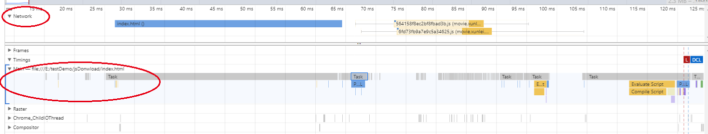

### 前言

在使用 Nuxt的过程中，发现 page 的 head 中按序引入 cdn script 脚本

```javascript
 head () {
    return {
      script: [
        {src: '//res.wx.qq.com/open/js/jweixin-1.2.0.js'},
        {src: '//test.com/my_wx_lib.js'}
      ]
    }    
  }
```
其中 my_wx_lib.js 的执行依赖于 jweixin-1.2.0.js， 部分情况下，my_wx_lib.js 的执行会报错，报错的原因是，其依赖的 wx 变量为 undefined
查看 index.html 中的 script 的顺序，没问题，script 也没有显式的 async 属性。


### 原因
nuxt head 里面动态加入的 script, 会在浏览器渲染的时候动态 appned 到 head 中
同时浏览器对于动态 append 的 script 脚本会默认设置为 async = true(虽然审查元素看不到，但是可以通过 chrome 浏览器控制台选中元素， 打印 $0.async 看出值为 true)


### 知识回顾
script 属性
- defer
立即下载，延迟执行(页面解析完毕)，规范是 defer 脚本按照顺寻执行，先于DOMContentLoaded事件执行， 实际是 不一定会按照顺序执行，也不一定会在 先于DOMContentLoaded事件执行。
下载，执行都不阻塞 dom 解析

- async
异步下载 js (下载过程不阻塞 dom 构建)， 下载完就立即执行

### 注意的点是： 浏览器不是串行下载资源的，而是并行下载的（最大6个资源一起加载）


### 也可以通过 chrome 开发这工具查看其执行过程
例如例子：  
```html
<!--index.html-->
<!DOCTYPE html>
<html>
<head>
	<title></title>
	<script type="text/javascript" src="http://movie.xunlei.com/_nuxt/564158f8ec2bf8fbad3b.js"></script>
	<script type="text/javascript" src="http://movie.xunlei.com/_nuxt/6fd73fb9a7e9c5a34625.js"></script>
</head>
<body>
</body>
</html>
```
其详情图图下所示：  

  

首先我们 network 一栏可以看到，浏览器首先下载 index.html, 当下载完成后，JavaScript 主进程 main 开始解析 HTML, 解析到 head 中时，发现有外部脚本，所以解析 html 停止，转而下载外部脚本，可以看到
两个外部脚本几乎同时开启下载，下载完成后，先执行第一个脚本，再执行第二个脚本，再继续解析 HTML。  


下面这张图很好的展示了几种加载方式去的区别：


