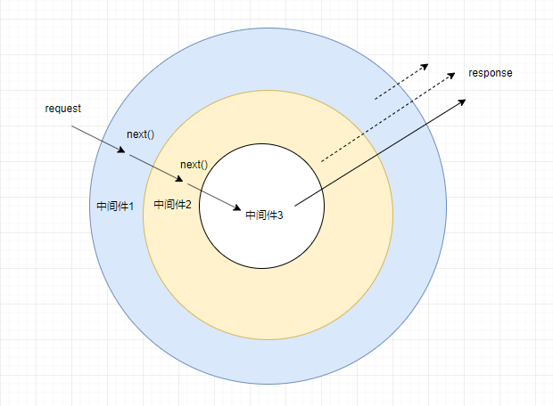

### 前言
在 NodeJS 中 express 和 koa 可以说是两个比较著名的服务端框架，express 成型较早于 koa，两者比较大的差异在于 express 主要基于异步回调的处理方式，而且集成了丰富的功能模块(静态文件，路由支持)，相比之下 koa 则轻便了很多，koa 使用了 ES8 的新语法 async/await 代替了回调函数，使得 逻辑更加简单明了，同时  Koa 并没有捆绑任何中间件。

###  express 和 koa 中间件解析
用过或者了解过 koa 的人都知道，koa 的中间件采用了一种被称为 “洋葱模型” 的中间件形式，那么什么是洋葱模型，其与 express 中的中间件的模式区别在哪里？有什么样的优缺点？接下来我们来逐个分析。


#### 从一个例子来窥探 express 和 koa 中间件处理流程
express 代码
```javascript
const express = require('express')
const app = new express()
// 中间件1
app.use((req, res, next) => {
  console.log('中间件1 start')
  next()
  console.log('中间件1 end')
  res.json({
   result: '中间件1' 
 })
})

// 中间件2
app.use((req, res, next) => {
    console.log('中间件2 start')
    next()
    res.json({
      result: '中间件2' 
    })
    console.log('中间件2 end')
  })
  // 中间件3
app.use((req, res, next) => {
    console.log('中间件3 start')
    res.json({
      result: '中间件3' 
   })
    console.log('中间件3 end')
  })
  app.listen(9001)
```

koa 代码
```javascript
const koa = require('koa')
const app = new koa()
// 中间件1
app.use(async  (ctx, next) => {
  console.log('中间件1 start')
  await next()
  console.log('中间件1 end')
  ctx.body = {
   result: '中间件1' 
 }
})

// 中间件2
app.use(async (ctx, next) => {
    console.log('中间件2 start')
    await next()
    console.log('中间件2 end')
    ctx.body = {
      result: '中间件2' 
    }
  })

  // 中间件3
app.use(async (ctx, next) => {
    console.log('中间件3 start')
    console.log('中间件3 end')
    ctx.body = {
      result: '中间件3' 
    }
  })

  app.listen(9001)
```

##### 提问：当分别用浏览器访问 127.0.0.1:9001 的时候，服务日志输出的是什么，浏览器接收到结果是什么? 
(如果知道结果，可以选择跳过这部分内容)

其结果是：服务控制台输入的日志都是一样的，而浏览器接收到的结果略有不同.
其服务输出日志为：

```javascript
中间件1 start
中间件2 start
中间件3 start
中间件3 end
中间件2 end
中间件1 end
```

koa 服务浏览器接收到响应
```javascript
{"result":"中间件1"}
```

express 服务浏览器接收到的响应
```javascript
{"result":"中间件3"}
```
同时 express 服务还会抛出一个异常
```javascript
Cannot set headers after they are sent to the client.......
```
那么，因为会出现两个不同的结果？要弄清这个问题原因，我们就需要知道 express 和 koa 中间件的处理模式。


### 洋葱模型
koa 中间件模型入下图所示：  




### 参考文章
https://segmentfault.com/a/1190000013981513