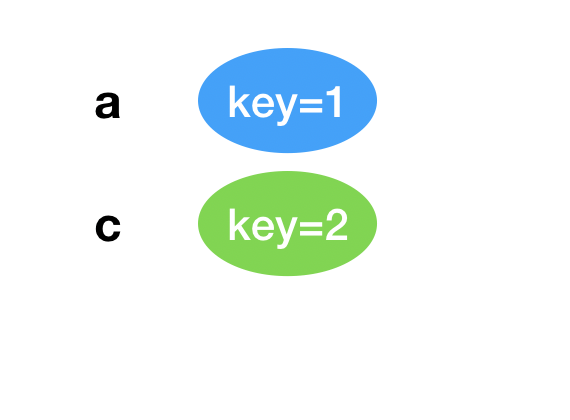

## 前言
在日常使用 React 开发的过程中，我们常常会遇到列表渲染的场景，而其中 key 是列表渲染中非常重要的一个属性，正确的使用 key 可以提升列表渲染性能，而错误使用 key 可能会导致奇怪的 bug 以及额外的性能开销, 今天我们就来了解学习 React key。


本文主要包含以下的内容：  
1. 从一个例子说起
2. 为什么会出现奇怪的表现
3. React 如何利用 key 进行渲染
4. 如何正确的使用 key
5. 结语


### 从一个例子说起
在某次开发需求的过程中，涉及到了列表渲染的逻辑，然后遇到了奇怪的问题，代码如下所示：
```javascript
type MyState = {
  list: string[]  
}

class Demo extends React.Component<any, MyState> {
  constructor(props: any) {
    super(props)
    this.state = {
      list: ['a', 'b', 'c']  
    }
  }
  handleDelete(index: number) {
    console.log('index', index)
    const list = [...this.state.list]
    list.splice(index, 1)
    this.setState({
      list  
    });
  }
  render() {
    return (this.state.list.map((item, index) => {
      return (
      <div key={index} style={{padding: '20px'}}>
        <span> name: { item }</span>
        <input type="text"/>
         <button
           onClick={this.handleDelete.bind(this, index)}
           style={{marginLeft: '20px'}}
         >删除</button>
       </div>  
      )
    }))    
  }
}
```
代码逻辑很简单，就是一个列表，然后用 index 作为 key, 点击删除第二个的时候，可以正常删除

 


我们现在 b 输入框中，输入一个字符

 


然后删除 b item
   


第二项确实删除了，但是为啥第二项输入框的内容跑到了第三项中？

思考🤔。。。


### 为什么会出现这种奇怪的表现
其实，造成这种表现是因为错误的使用了 key 而导致的，对于 key 相同的节点（这里的节点指的是 virtual dom），React 在更新的过程中，会认为这俩个节点是相同的，所以会复用原有的节点。

删除之前的 virtual dom 如下图所示

  


删除之后的 vitrual dom 如下图所示：

 


可以看到，删除第二项后，原本第三项的 key 变成了 2， 即是 第二项的 key

所以，React 在 diff 的过程中，会认为两项是一样的节点，所以会复用 key 为 2 的这一项 dom 节点，然后仅仅对相应的属性进行更新，这里就是对应的 name 更新为 c, 而 input 输入框的状态复用了，导致看起来像是在第三项输入了内容。


### React 如何利用 key 进行渲染
在这之前，我们先来简单学习一下 React（React 16）

React 架构可以分为三个部分，每个部分分别负责处理不同的任务，如下图所示：

 

需要注意的是，调度器和协调器是可以中断的。

>
调度器是在 React 16 引入的，React 16 前，组件的挂在 会调用mountComponent，组件更新会调用updateComponent。这两个方法都会递归更新子组件。对于 React 的更新来说，由于递归执行，所以更新一旦开始，中途就无法中断。当层级很深时，递归更新时间超过了16ms，用户交互就会卡顿。


比如一个简单的🌰
```javascript
export default class Count extends React.Component {

  constructor(props) {
    super(props);
    this.state = {
      count: 1  
    }  
  }
  render () {
    return (
      <div>
        <p>{ this.state.count }</p>
        <button onClick={() => {
          this.setState({
            count: this.state.count + 1  
          })  
        }}>+1</button> 
      </div>  
    ) 
  }
```

在点击按钮的时候，React 的执行过程大致是这样的：

  


而 React 利用 key 的优化渲染的地方，也主要是在 Reconciler 部分，即是 virtual dom 的 diff 过程.

>
React 对于同一层级的节点 diff 更新的逻辑是： 首先对新集合的节点进行循环遍历，for (name in nextChildren)，通过唯一 key 可以判断新老集合中是否存在相同的节点，if (prevChild === nextChild)，如果存在相同节点，则进行移动操作，但在移动前需要将当前节点在老集合中的位置与 lastIndex 进行比较，if (child._mountIndex < lastIndex)，则进行节点移动操作，否则不执行该操作

其实就是对于 key 相同且元素类型相同的节点，进行复用。


如果是不用的 key 的情况下：

   

这种情况下：
老集合中包含节点：A、B、C、D  
更新后的新集合中包含节点：B、A、D、C  
此时新老集合进行 diff 差异化对比，发现 B != A ，则创建并插入 B 至新集合，删除老集合 A；以此类推，创建并插入 A、D 和 C，删除 B、C 和 D。

React 发现这类操作繁琐冗余，因为这些都是相同的节点，但由于位置发生变化，导致需要进行繁杂低效的删除、创建操作，其实只要对这些节点进行位置移动即可。  


如果是有唯一 key 的情况：
  

React 通过 key map 发现新节点在老得列表里面都有，所以直接复用，只需要移动老的节点的位置即可。


### 如何正确的使用 key
1. 尽量选择唯一的属性值作为 key，特别是列表顺序会动态调整的场景
2. 对于列表翻页的情况，可以选择 index 作为 key, 方便组件复用
3. 数组元素中使用的 key 在其兄弟节点之间应该是独一无二的，不同列表之间的 key 值不会相互影响


### 参考文章
[Index as a key is an anti-pattern](https://robinpokorny.medium.com/index-as-a-key-is-an-anti-pattern-e0349aece318)  
[React从渲染原理到性能优化（一）](https://mp.weixin.qq.com/s?__biz=MjM5MTA1MjAxMQ==&mid=2651229767&idx=1&sn=8f06283e43cfcda722189b56644f4dfc&chksm=bd4957c38a3eded58cd388130c4f303ff4033213ffcf157698d50f1ebfe87788a7f74d8be76a&scene=21#wechat_redirect)  
[React渲染原理](https://zhuanlan.zhihu.com/p/45091185)  
[React 源码分析](https://react.jokcy.me/book/api/react.html)  
[React技术揭秘1-2 React架构](https://juejin.cn/post/6844904183057874951)  
[React技术揭秘](https://react.iamkasong.com/)  
[React源码解析](https://zhuanlan.zhihu.com/p/93269914)


