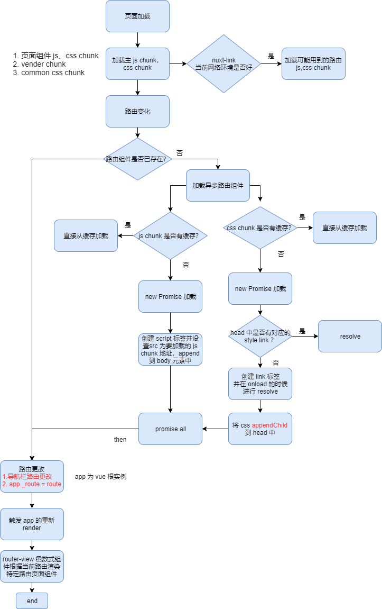

### 1. 背景
有的项目使用的 Nuxt 框架，并且开启了 **extractCSS**(**extract-css-chunks-webpack-plugin** 并配置了将主块中的 CSS 提取到一个单独的 CSS 文件中（自动注入模板）),这导致了一个 css 文件过于庞大，且存在严重的样式污染问题，本文通过梳理 Nuxt 样式打包过程，并且提出一些解决方案。

### 2. Nuxt 样式默认打包过程
Nuxt 默认的情况下，会将每个路由作为一个单独的 chunk 打包构建，即是每个路由都会创建一个 js 文件(因为 nuxt 路由都是懒加载的形式), 也就是当进入到该路由的时候，才会去加载改路由下的 js 文件

在编写 nuxt 项目的过程中，css 有两种引入的书写方式：

1. 直接写到 .vue 文件里的 style 标签内部：
```html
<!--page/index.vue-->
<style lang="css">
  p{color: red}
</style>

<!--或者-->
<style lang="css" src="@/aseets/index.css">
</style>
```
在这种情况下，css 会先经过 **css-loader**, 再到 **vue-style-loader** 插入到 html 中， 如果是服务端渲染，则会将 style 插入到 html 模板中，返回给前端。如果是前端渲染，则是通过 js 动态创建 style 的方式插入到 dom 中。


2. 直接在组件内 import css 文件：

```javascript
// page/index.vue
<script>
import '@/assets/index.css'
export default {
}
<script>
```
这种情况下，css 将会首先通过 **css-loader**, 到 **vue-style-loader**，生成动态将样式插入到 style 标签内的方法，并在该 js chunk 加载的时候执行， 也就是无论在前端渲染，还是在服务端渲染，都是在浏览器渲染的时候，通过 js 动态插入(head append child) 样式的方法注入样式。

这里顺便提一下 **vue-style-loader**  

>[vue-style-loader](https://github.com/vuejs/vue-style-loader)  
>>**vue-style-loader** 库是 fork 自 **style-loader** 的，其扩展了 **style-loader**, 提供了在 SSR 服务端渲染的时候，将样式插入到 html 字符串中的功能。


### 3. 配置了 extractCSS 时的样式打包过程
配置了这个属性为 true 的时候，nuxt 会根据路由 chunk, 将每个 chunk 内的样式，打包到同一个 css 文件中, 无论是通过 import 或者写在 Vue 单文件里面 style 标签内的样式，都会被统一打包到一个 css 文件中，也就是说，有多少个懒加载路由，打包生成就会有至少有 css 文件。nuxt.config.js 配置的公共 css 也会独立打包成一个 css 文件


### 4. 样式分割时，在路由切换时样式加载过程

nuxt 在服务端渲染的情况下，会返回当前路由需要用的 js chunk 和 css chunk, 如果当前页面有路由导航器 (nuxt-link)，并且在网络良好的情况下，nuxt 会预加载 (prefetch) 可能用到的路由下的 js chunk 和 css chunk (其利用了 **Navigator.connection** 来获取网络的状态)，如果是网络情况不好的环境，则不会预加载(当然 nuxt-link 也支持取消自动 prefetch, 或者可以使用 router-link 替代 nuxt-link)


其流程图如下所示：  


  


在上述的流程图中，异步加载 css chunk 部分的代码是由 webpack 的 css 插件完成的。


通过图中的流程图，我们知道在切换到新路由时，在下载完新路由 js chunk 和 css chunk 之后，路由界面未更新为新界面之前，会可能存在短暂的样式污染问题，因为此时新路由的 css chunk 会作用于旧页面 html。


需要注意的是，上述流程图中，css 异步加载的过程，是需要 webpack 配置了 css 提取插件的时候才有效的，例如配置了 **mini-css-extract-plugin** 插件。


### 样式合并处理
我们可以对 nuxt 进行构建的配置，将所有的 chunk 的 css 文件都打包到同一个文件内，以此减少请求和重复打包。

```javascript
 extractCSS: true,
 optimization: {
   minimize: true,
   minimizer: [
     new OptimizeCssAssetsPlugin({
       assetNameRegExp: /.css$/g // 对 css 压缩
     })
   ],
   splitChunks: {
     chunks: 'all',
     cacheGroups: {
       styles: {
         name: 'styles',
         test: (mod, chunks) => {
           return mod.type === 'css/extract-css-chunks'
         },
         chunks: 'all',
         priority: 20,
         enforce: true,
       }
    }
 }
```  

这个样会把所有 **extract-css-chunks-webpack-plugin** 插件提取出来的 css 合并到一个 css 文件中，这样就可以减少大量请求。

但是这样也存在一些问题：

1. 项目过大时，单个 css 文件会过于庞大。
2. css 全部糅合在一个文件中，且在每个路由中都用同一个 css, 容易造成样式污染。


### 5. 折中解决方案
综合上述根据路由分割样式和将所有样式打包到一个文件内情况，我们需要制定一个合理的样式加载方式，或者在 nuxt 原有的加载方式上进行优化。

其须满足以下的几点要求：
- 当前路由只加载关键 css，避免不必要的请求
- 不同路由避免相互之间的样式污染
- 尽量减少样式重复打包的问题

基于上述的需求，决定在样式按路由分割的基础之上进行优化，为了保证不同路由之间的样式污染，需要在路由切换的时候，对当前页面样式进行处理。

- 1 页面按路由切割样式，当前页面只加载当前路由需要的样式文件(已有功能)
- 2 路由切换时，在新页面 mounte 之后，移除上一个路由的样式文件，防止样式污染
- 3 对于重复引用的问题，如果被重复引用的样式文件大于某个确定的值，并且被两个以上的路由引用，则提取为公共的样式文件


### 6.折中方案实现
- 1.分离公共使用的 css (尽量减少重复打包)

```javascript
 // nuxt.config.js
 splitChunks: {
     chunks: 'all',
     cacheGroups: {
       styles: {
         name: 'styles',
         test: (mod, chunks) => {
           return mod.type === 'css/extract-css-chunks'
         },
         chunks: 'all',
         minChunks: 3,// 在三个路由中被使用到则提取
         enforce: true,
         minSize: 10000 // 大于 10kB 才提取
       }
     }
  }
```
需要注意的是，这样独立出来的样式文件，会通过 js 脚本动态插入 style 的方式作用与页面

- 2.在当前路由加载前的时候加载当前路由需要的样式，在当前路由加载完成后，删除上一个路由的样式文件

由上述的需要，可以很容易的想到，在 vue-router 路由钩子进行处理，在路由钩子里面根据当前的路由和即将要到达的路由，匹配特定的样式文件来操作。

但是我们知道，因为在写路由钩子的时候，样式文件还没生成，同时样式文件的名称一般都是带一长串的 hash 的，所以我们需要在代码编译的时候，得到路由 chunk 和 css 文件名的映射关系，所以这里决定使用 webpack 插件来做，通过注入变量的方式，来拿到路由 chunk 和 css 文件名的关系。


插件代码如下:
```javascript


const Template = require('webpack').Template
const pluginName = 'chunk-name-map-css-file'
const extraCssType = 'css/extract-css-chunks'
const NOT_CSS_HASN = '31d6cfe0d16ae931b73c'
/**
 * TODO
 * 使用 extract-css-chunk 的时候
 * 某个路由 chunk 在没有使用 css 的情况下，也会生成 css chunkHash, 其值为 31d6cfe0d16ae931b73c
 * 判断在这个 hash 的情况下，认为该路由 chunk 没有样式文件
 * */

class RouterChunkToCssPlugin {
  apply (compiler) {
    const loadedCss = {}
    let sourceCode = []
    compiler.hooks.thisCompilation.tap(pluginName, compilation => {
      const { mainTemplate } = compilation
      mainTemplate.hooks.localVars.tap(pluginName, (source, chunk) => {
        compilation.chunks.forEach((chunk) => {
          if (/pages[_\/].*?/.test(chunk.name) &&
             chunk.contentHash &&
             chunk.contentHash[extraCssType] &&
             !loadedCss[chunk.name] &&
             chunk.contentHash[extraCssType] !== NOT_CSS_HASN
          ) {
            let name = chunk.name.replace(/\//g, '_') // pages/videos/_id/index -> pages_videos__id_index, 便于在路由钩子匹配
            sourceCode.push(`"${name}": '${chunk.contentHash[extraCssType]}.css'`)
            loadedCss[chunk.name] = 1
          }
        })
        if (sourceCode.length && compilation.options.name === 'client') {
          return Template.asString([source, '//', '// set global function variable for css manager', `!function(global){global.getRouteMapCssFile = function (chunkName){ 
  var routerMap = {${sourceCode.join(',')}};
  return {all: routerMap, cssChunk: ${mainTemplate.requireFn}.p + routerMap[chunkName]};}}(window)`])
        }
        return source
      })
    })
  }
}
module.exports = RouterChunkToCssPlugin

```
其作用的是，在编译的时候，扩展输出，在 runtime chunk 中插入 router chunk 和 css 文件名的映射关系，作为 window 的全局变量存在。

接下来是，在路由钩子里，做 css 样式文件的管理
```javascript
// plugins/router-event.js
export default ({ app }) => {
  let timer = null
  if (typeof window.getRouteMapCssFile === 'undefined') return
  const getRouteMapCssFile = window.getRouteMapCssFile
  // 路由解析钩子- 加载需要的样式(如果样式文件不存在的话)
  app.router.beforeResolve((to, from, next) => {
    if (timer) clearTimeout(timer)
    if (!to.name || !from.name) {
      return next()
    }
    const chunName = pathToChunkName(to.name, to.path)
    let { cssChunk, all } = getRouteMapCssFile(chunName)
    if (!all[chunName] || to.name === from.name) return next()
    setCurrentCssFile(cssChunk, next)
  })
  // afterEach - 全局后置钩子， 此时异步组件已经加载完毕，这里用 setTimeout 确保页面已经渲染完毕
  app.router.afterEach((to, from) => {
    if (to.name !== from.name && from.name) {
      const chunName = pathToChunkName(from.name, from.path)
      let { cssChunk, all } = getRouteMapCssFile(chunName)
      if (!all[chunName]) return
      timer = setTimeout(() => {
        removeCssFile(cssChunk)
      }, 1000)
    }
  })
}
// pathName 转化为 chunkName
function pathToChunkName (pathName, path) {
  const pathArr = path.split('/').slice(1)
  let paths = pathName.split('-')
  for (let i = 0, len = pathArr.length; i < len; i++) { // 处理动态路由
    if (/\d+/.test(pathArr[i])) {
      paths[i] = `_${paths[i]}`
    }
  }
  if (paths[paths.length - 1] === '_id') {
    paths.push('index')
  }
  paths.unshift('pages')
  return paths.join('_')
}

function setCurrentCssFile (path, next) {
  const head = document.querySelector('head')
  const link = document.querySelectorAll('link')
  let hasStyle = false
  for (let i = 0, len = link.length; i < len; i++) {
    if (link[i].getAttribute('href') === path && link[i].getAttribute('rel') === 'stylesheet') {
      hasStyle = true
      break
    }
  }
  if (!hasStyle) {
    let newLink = document.createElement('link')
    newLink.onload = next
    newLink.onerror = next
    newLink.setAttribute('rel', 'stylesheet')
    newLink.setAttribute('href', path)
    head.appendChild(newLink)
  } else {
    next()
  }
}

function removeCssFile (path) {
  const head = document.querySelector('head')
  const link = document.querySelectorAll('link')
  for (let i = 0, len = link.length; i < len; i++) {
    if (link[i].getAttribute('href') === path && link[i].getAttribute('rel') === 'stylesheet') {
      head.removeChild(link[i])
      break
    }
  }
}

```
### 7. 适用场景
需要注意的是，上述适用于单页面的的场景，且是路由在当前页面打开(通过 router.push、router.replace), 如果站点主要是通过 location.href、window.open 或者

在新窗口打开页面的形式切换路由的话，则采取上述的方式没有太大的优势，因为通过这种方式打开的情况下，站点页面会整站刷新。

css 样式动态载入和删除的逻辑，在网络请求上，不会造成大量的耗时网络请求，因为本地缓存原因，第二次的加载会直接从缓存加载。


