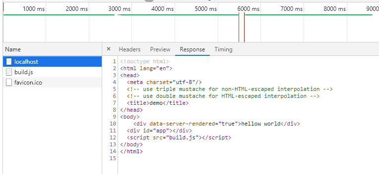

### 前言
在前面的文章[Vue服务端渲染](../Vue服务端渲染/README.md) 我么讲述了 Vue 服务端渲染的原理极其过程，其中涉及到的一个很关键的过程是服务端从组件到 HTML 字符串的创建过程，我们知道服务端是没有 Dom 元素对象的，那么 Vue 示例是如何转换为 HTML 字符串的呢？今天我们就一起来学习一下其中的原理知识。

本文主要包含以下几方面的内容
- 1.前端渲染中，一个 Vue 实例 mounted 过程原理
- 2.服务端渲染中，Vue 实例 renderToString 的过程原理
- 3.Vue 服务端渲染和前端渲染的差异比较


### Vue 页面在浏览器中渲染过程
对 Vue 熟悉的人都知道，Vue 可以通过以下简单的方式，实现 Vue 实例在前端页面的渲染：
```javascript
// app.vue
<template>
  <div>{{mssage}}</div>
</template>
<script>
  export default {
    data () {
      return {
         massge: 'hellow world' 
      }
    }
  }
</script>

// main.js
import Vue from 'vue'
import App from 'App.vue'
new Vue({
  el: '#app',
  render: (h) => h(App) 
})
```

其实例构建到 mount 的流程图如下所示：  
  
  

基于上述的流程图中，我们可以知道：

#### 1. Vue 数据响应过程
- Vue 数据响应是通过 Object.defineProperty (3.0 版本改成 proxy),劫持数据的 getter 和 setter，在初始化 Vue 实例的时候，会将需要观测的数据遍历进行 Object.defineProperty 并通过闭包的形式，给每个数据生成一个 Dep 对象，该对象会在该数据被取值的时候，将对应的 Vue 实例添加为自己的订阅者。


- Vue 在初次渲染的时候，会给每个 Vue 实例创建一个 Watcher, 并将该 Watcher 的 callback 和 getter 设置为更新渲染该 Vue 实例的 updateComponent， updateComponent 定义如下：
```javascript
   updateComponent = function () {
      vm._update(vm._render(), hydrating);
   };
```
然后将该 Watcher 保存起来，接着会调用 render 函数，render 函数里面会用到 data 里面的数据，所以会触发数据的 getter, 在 getter 函数里面将 Watcher 添加为该数据的订阅者，在该数据被更改的时候，便可以遍历该数据的 Dep 里面存的订阅者，依次将 Watcher 拿出来，执行 Watcher 的 callback, 从而触发重新渲染。


#### 2. 浏览器中，VNode 到真实 Dom 的过程(初次渲染)
在将 VNode 渲染为真实 Dom 的过程中，首先会从祖先 VNode 开始，依次创建 VNode,直到 VNode 的类型是 Dom 类型的时候，开始调用 Dom 方法生成真实的 Dom 片段，添加到父 VNode 中，最终将根 VNode 的 Dom 添加为真实的 Dom, 完成渲染。


### Vue 服务端页面渲染过程
我们知道，Vue 支持服务端渲染，那么服务端渲染和前端渲染有啥不一样的呢？首先我们可以明确的几点是：

- 服务端渲染的时候不需要对数据做观察检测变化。
- 服务端渲染的 VNode 到 Dom 片段的方法，调用的一定不是浏览器的自带的 Dom 操作方法。

那么，服务端渲染流程具体是怎样的？其和前端渲染有什么不一样的地方呢？接下来就让我们一起来看看：


我们先来编写服务端渲染的代码：


#### 修改主入口文件
我们修改主入口文件，使其导出一个 Vue 示例，给服务端渲染的时候使用
```javascript
// main.js
import Vue from 'vue'
import App from './App.vue'
export const app =  new Vue({
  el: '#app',
  render: (h) => h(App) 
})
```


#### 增加 Webpack 配置，使入口极其依赖导出为 NodeJs 使用的 CommonJs 规范

```javascript
// webpack.server.js
var path = require('path')
var webpack = require('webpack')
var merge = require('webpack-merge')
var baseWebpackConfig = require('./webpack.config')
var webpackConfig = merge(baseWebpackConfig, {
    target: 'node',
    entry: {
        app: './main.js'
    },
    devtool: false,
    output: {
        path: path.resolve(__dirname, './dist'),
        filename: 'build-server.js',
        libraryTarget: 'commonjs2'
    },
    externals: Object.keys(require('./package.json').dependencies),
})
module.exports = webpackConfig
```
注意，服务端渲染的时候，依赖在服务端都是同步加载的，所以 package.json 里面的 dependencies 都要设为 externals, NodeJs 服务在运行的时候会同步加载依赖。

#### 启动 NodeJs 服务，处理请求，生成 html 字符串并相应请求

```javascript
const express = require('express');
const server = express();
const fs = require('fs');
const path = require('path');
const app = require('./dist/build-server.js').app

const renderer = require('vue-server-renderer').createRenderer({
  template: fs.readFileSync('./index.html', 'utf-8')
});
server.get('*', (req, res) => { 
   renderer.renderToString(app, function (err, html) {
     if (err) {
       if (err.code === 404) {
         res.status(404).end('Page not found')
       } else {
         res.status(500).end('Internal Server Error')
       }
     } else {
       res.end(html)
     }
   });         
}); 
server.listen(8080);
```
我们构建好 bundle-server 之后，开启 NodeJs 服务，浏览器访问 http://localhost:8080/, 查看相应内容如下所示：

  


可以看到，服务端将 Vue 组件渲染成了 HTML 字符串，并返回到给了浏览器，从而可以让浏览器直接渲染 Dom, 这对于 SEO 和 首屏体验来说都是有积极的作用的。


接下来我们来看看，入口文件中，Vue 根节点示例化的过程在服务端和浏览器端有什么样的区别：

通过单点逐行代码调试，我们可以等到在服务端中，Vue 实例化的过程如下图所示：


VueJs 提供了一个环境变量 VUE_ENV，当该环境变量的值为 server 的时候，不进行数据劫持观测。 


### tips
组件生成周期函数，例如 created、 beforeCreate 等，即时是用 async await 的阻塞函数运行也不会阻塞组件 render ，以及其他生命周期函数的执行
因为本质上，
