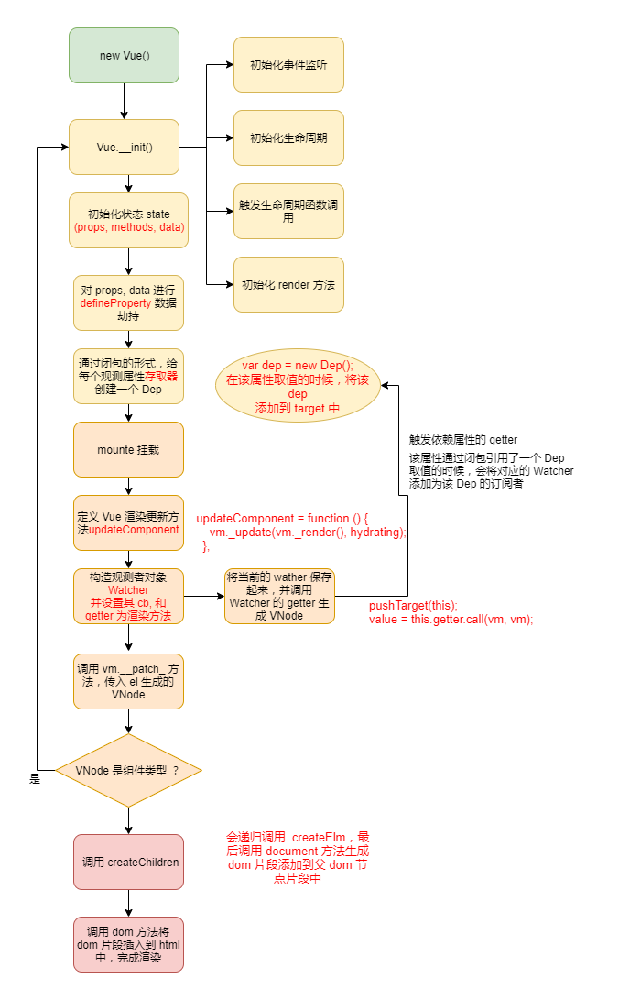

### 前言
在前面的文章[Vue服务端渲染](../Vue服务端渲染/README.md) 我么讲述了 Vue 服务端渲染的原理极其过程，其中涉及到的一个很关键的过程是服务端从组件到 HTML 字符串的创建过程，我们知道服务端是没有 dom 元素对象的，那么 Vue 示例是如何转换为 HTML 字符串的呢？今天我们就一起来学习一下其中的原理知识。

本文主要包含以下几方面的内容
- 1.前端渲染中，一个 Vue 实例 mounted 过程原理
- 2.服务端渲染中，Vue 实例 renderToString 的过程原理
- 3.Vue 服务端渲染和前端渲染的差异比较


### Vue 前端页面渲染过程
对 Vue 熟悉的人都知道，Vue 可以通过以下简单的方式，实现 Vue 实例在前端页面的渲染：
```javascript
// app.vue
<template>
  <div>{{mssage}}</div>
</template>
<script>
  export default {
    data () {
      return {
         massge: 'hellow world' 
      }
    }
  }
</script>

// main.js
import App from 'App.vue'
new Vue({
  el: '#app',
  render: () 
})
```

其实例构建到 mount 的流程图如下所示：  
  

基于上述的流程图中，我们可以知道：

#### 1. Vue 数据响应过程
- Vue 数据响应是通过 Object.defineProperty (3.0 版本改成 proxy),劫持数据的 getter 和 setter，在初始化 Vue 实例的时候，会将需要观测的数据遍历进行 Object.defineProperty 并通过闭包的形式，给每个数据生成一个 Dep 对象，该对象会在该数据被取值的时候，将对应的 Vue 实例添加为自己的订阅者。


- Vue 在初次渲染的时候，会给每个 Vue 实例创建一个 Watcher, 并将该 Watcher 的 callback 和 getter 设置为更新渲染该 Vue 实例的 updateComponent， updateComponent 定义如下：
```javascript
   updateComponent = function () {
      vm._update(vm._render(), hydrating);
   };
```
然后将该 Watcher 保存起来，接着会调用 render 函数，render 函数里面会用到 data 里面的数据，所以会触发数据的 getter, 在 getter 函数里面将 Watcher 添加为该数据的订阅者，在该数据被更改的时候，便可以遍历该数据的 Dep 里面存的订阅者，依次将 Watcher 拿出来，执行 Watcher 的 callback, 从而触发重新渲染。


#### 2. 浏览器中，VNode 到真实 Dom 的过程(初次渲染)
在将 VNode 渲染为真实 Dom 的过程中，首先会从祖先 VNode 开始，依次创建 VNode,直到


### tips
组件生成周期函数，例如 created、 beforeCreate 等，即时是用 async await 的阻塞函数运行也不会阻塞组件 render ，以及其他生命周期函数的执行
因为本质上，
