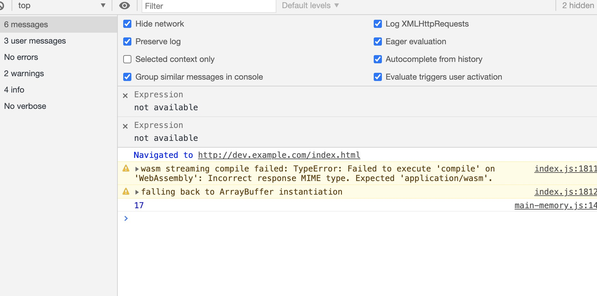
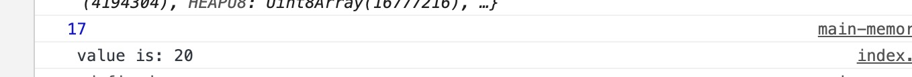
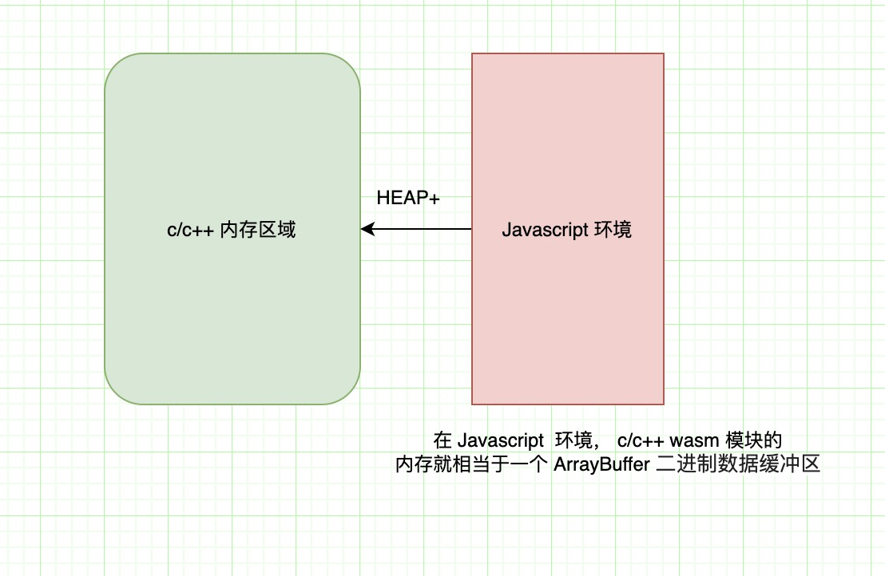

## WebAssembly内存模型
在将 c/c++ 代码编译为 asm.js 或者 wasm，C/C代码眼中的内存空间实际上对应的都是Emscripten提供的ArrayBuffer对象：Module.buffer，C/C内存地址与Module.buffer数组下标一一对应。

C/C代码能直接通过地址访问的数据全部在内存中（包括运行时堆、运行时栈），而内存对应为 Module.buffer 对象，C/C++ 代码能直接访问的数据事实上被限制在Module.buffer内部，JavaScript环境中的其他对象无法被 C/C++ 直接访问——因此我们称其为单向透明的内存模型。

在当前版本的Emscripten中，指针（既地址）类型为int32，因此单一模块的最大可用内存范围为2GB-1。未定义的情况下，内存默认容量为16MB，其中栈容量为5MB。


### Module.HEAPX
JavaScript中的 ArrayBuffer 无法直接访问，必须通过某种类型的 TypedArray 方可对其进行读写。

>> TypedArray：ES6 引入的一个一个类型化数组，描述了一个底层的二进制数据缓冲区（binary data buffer）的一个类数组视图，假设我们想知道一个 256 位（即是 32 个字节）的 arrayBuffer 的内容，我们是无法直接通过访问它的，不仅因为没有相关的 API 去操作，更重要的是，我们不知道 32 个字节数据中，多少个字节代表一个数据，如果是存储的都是 0 到 255 的无符号整型，那么每1个字节就代表一个数据，此时我们需要使用 Uint8Array 去映射这块内存缓冲区，也就是得到 32 个数据，如果存的是 0 到 65535 的无符号数据，我们就需要使用 Uint16Array 去映射，也就是每两个字节代表一个数据。


Emscripten已经为Module.buffer创建了常用类型的TypedArray，见下表：

 


### 在JavaScript中访问C/C++内存
我们实现通过在 c++ 的方法中放回变量指针，然后在 Javascript 中得到这个指针，并用这个指针拿到 c++ 里面定义存储的数据：

首先是 c++ 代码：

```c++
// memory.cpp
#include <iostream>

extern "C" { 
  int* get_int_addr();
}

int a = 17;

int* get_int_addr(){
  return &a;
}

```
第二步： 通过 trzeci/emscripten 镜像编译 c++ 文件，生成 index.wasm 和胶水代码 index.js

```shell
 docker run \
  --rm \
  -v "$(pwd):$(pwd)" \
  -u $(id -u):$(id -g) \
  trzeci/emscripten \
  emcc "$(pwd)/memory.cpp" -s "EXPORTED_FUNCTIONS=['_get_int_addr']" -s WASM=1 -s MODULARIZE=1 -s ENVIRONMENT=web -o "$(pwd)/index.js"  
```

第三步：index.htm 引入胶水代码（胶水代码里面会自动引入并初始化 wasm 文件模块）


```html
<!DOCTYPE html>
<html lang="en">
<head>
  <meta charset="UTF-8">
  <meta name="viewport" content="width=device-width, initial-scale=1.0">
  <title>Document</title>
</head>
<body>
  <div>wasm demo</div>
</body>
<script src="./index.js"></script>
<script src="./main-memory.js"></script>
</html>
```

第四步：使用 wasm 模块对象
胶水代码会自动引入并初始化 wasm, 同时会挂载 wasm 模块对象到环境中。

````javascript
if (typeof exports === 'object' && typeof module === 'object')
  module.exports = Module;
else if (typeof define === 'function' && define['amd'])
  define([], function() { return Module; });
else if (typeof exports === 'object')
  exports["Module"] = Module;
    
````
可以看到， 胶水代码以 umd 的方式导出了模块，默认模块名称为 Module, 我们可以在编译的时候更改名称：

编译的时候增加参数

```shell
-s EXPORT_NAME="WasmModule"
```

得到：

```javascript
if (typeof exports === 'object' && typeof module === 'object')
  module.exports = WasmModule;
else if (typeof define === 'function' && define['amd'])
  define([], function() { return WasmModule; });
else if (typeof exports === 'object')
  exports["WasmModule"] = WasmModule;
```

调用 wasm 导出的方法，得到 c++ 的内存地址（需要注意的是，得到的指针是以字节 byte 为单位的偏移量）：

```javascript


/**
 * main-memory.js
 * Javascript 访问 c/c++ 内存里面的数据
 */


// wasm 胶水代码导出一个 wasm 对象为 Promise
window.WasmModule().then(module => {

  // 调用  c++ 导出的方法，得到内存地址，内存地址是偏移的字节数
  const pr = module._get_int_addr()

  //用 HEAP32 来访问内存中对应的数据，表示将内存地址按每个元素 4 个字节来访问
  console.log(module.HEAP32[pr / 4]) // 17
})
```

结果如下图所示：

  


同时我们可以在 Javascript 中通过 module.HEAP+ 来设置 c/c++ 内存的数据，然后在 c/c++ 访问设置的数据:

c++ 里面增加输出函数

```c++
extern "C" { 
  void print_var();
}

void print_var () {
  cout << " value is: " << a << endl;
}
```

编译增加导出函数
```shell
-s "EXPORTED_FUNCTIONS=['_get_int_addr', '_print_var']"
```


javascript 增加修改数据和输出数据

```javascript
// wasm 胶水代码导出一个 wasm 对象为 Promise
window.WasmModule().then(module => {

  // 调用  c++ 导出的方法，得到内存地址，内存地址是偏移的字节数
  const pr = module._get_int_addr()

  //用 HEAP32 来访问内存中对应的数据，表示将内存地址按每个元素 4 个字节来访问
  console.log(module.HEAP32[pr / 4]) // 17
   
  // 更改 c++ 里面的变量数据
  module.HEAP32[pr / 4] = 20
  
  // 输出更改后的结果
  console.log(module._print_var())

})
```

结果如下图所示：  

  


在使用 wasm 模块时，对于 Javascript 环境来说，c/c++ 模块的内存数据都存在于一个 ArrayBuffer 中，可以通过 wasm 模块的 HEAP+ 来访问这段内存区域：




