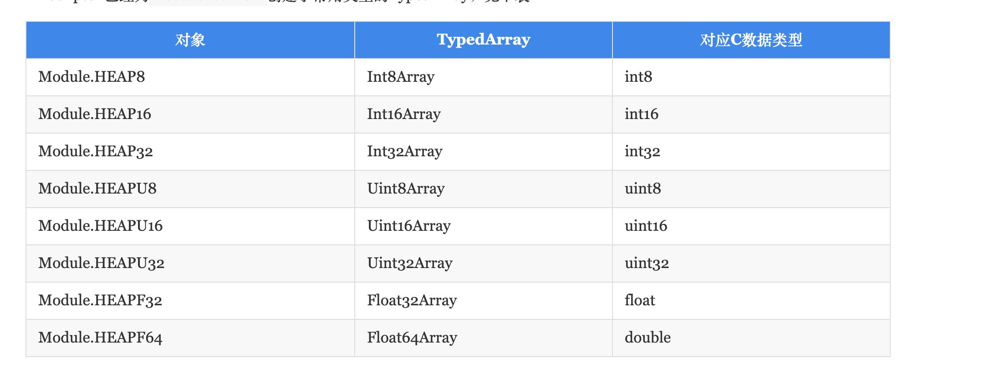

## WebAssembly内存模型
在将 c/c++ 代码编译为 asm.js 或者 wasm，C/C代码眼中的内存空间实际上对应的都是Emscripten提供的ArrayBuffer对象：Module.buffer，C/C内存地址与Module.buffer数组下标一一对应。

C/C代码能直接通过地址访问的数据全部在内存中（包括运行时堆、运行时栈），而内存对应为 Module.buffer 对象，C/C++ 代码能直接访问的数据事实上被限制在Module.buffer内部，JavaScript环境中的其他对象无法被 C/C++ 直接访问——因此我们称其为单向透明的内存模型。

在当前版本的Emscripten中，指针（既地址）类型为int32，因此单一模块的最大可用内存范围为2GB-1。未定义的情况下，内存默认容量为16MB，其中栈容量为5MB。

### Module.HEAPX
JavaScript中的 ArrayBuffer 无法直接访问，必须通过某种类型的 TypedArray 方可对其进行读写。

>> TypedArray：ES6 引入的一个一个类型化数组，描述了一个底层的二进制数据缓冲区（binary data buffer）的一个类数组视图，假设我们想知道一个 256 位（即是 32 个字节）的 arrayBuffer 的内容，我们是无法直接通过访问它的，不仅因为没有相关的 API 去操作，更重要的是，我们不知道 32 个字节数据中，多少个字节代表一个数据，如果是存储的都是 0 到 255 的无符号整型，那么每1个字节就代表一个数据，此时我们需要使用 Uint8Array 去映射这块内存缓冲区，也就是得到 32 个数据，如果存的是 0 到 65535 的无符号数据，我们就需要使用 Uint16Array 去映射，也就是每两个字节代表一个数据。

Emscripten已经为Module.buffer创建了常用类型的TypedArray，见下表：

   

