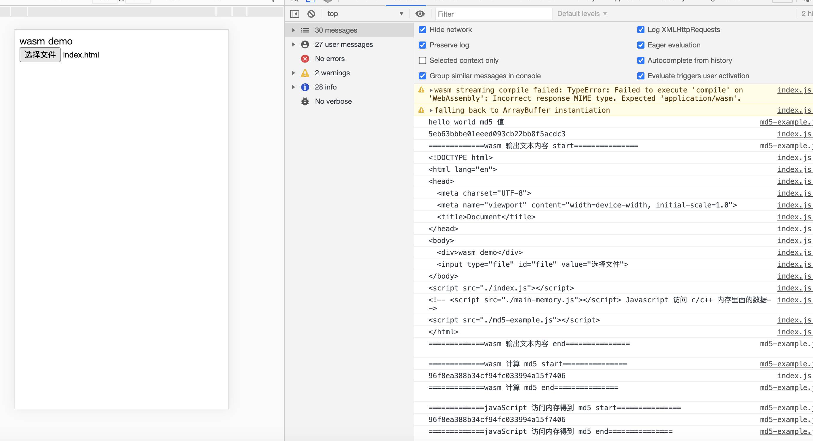

## 前言
前前前..周参加了一个线上的 WebAssembly 讨论分享会，对 WebAssembly 有了进一步的认识，所以通过这篇文章记录一下 WebAssembly 的学习总结。
本文主要包含以下的内容

1. WebAssembly 是什么
2. 为什么需要 WebAssembly 
3. WebAssembly 代码实战
4. WebAssembly 的未来展望
5. 总结


## WebAssembly 是什么
引入维基百科的介绍：
>WebAssembly 或称 wasm 是一个实验性的低级编程语言，应用于浏览器内的客户端, WebAssembly 被设计来提供比 JavaScript 更快速的编译及运行。WebAssembly 将让开发者能运用自己熟悉的编程语言（最初以C/C++作为实现目标）编译，再藉虚拟机引擎在浏览器内运行。WebAssembly 于 2019 年 12 月 5 日成为万维网联盟（W3C）的推荐，与 HTML，CSS 和 JavaScript 一起，成为 Web 的第四种语言。

首先，wasm 是一种编程语言，wasm 设计之处的目的就是为了解决 JavaScript  编译以及运行过程缓慢的问题，同时也可以作为一种目标语言，让开发者可以通过自己熟悉的编程语言，例如 c、c++, Rust 等编写代码，然后通过编译为 wasm 代码，运行在流程中，给其他开发这进入前端开发提供了一个路径。


## 为什么需要 WebAssembly 
事出皆有因，为什么会出现 wasm, wasm 的优势的是什么？从 wasm 的的描述中，我们可以总结出以下的主要的点：
1. 可移植
2. 相比 JavaScript 有更快的性能
3. 可以从其他代码转化为 wasm

也就是说，wasm 的出现一方面是补充加强 JavaScript 代码编译运行的速度的，提高性能。另一方面降低其他开发者进入前端开发的门槛，同时也使得成熟的第三方语言库、包、框架、项目迁移到 Web 平台内成为了可能。

那为什么需要提高性能，目前的 Javascript 的运行速度无法满足我们普通的功能页面吗？

答案是可以满足普通的功能页面，但是随着 web 技术发展的日益更新，web 应用的功能变得越来越广泛，从以前的纯文本，图片展示，到现在的多媒体处理，AR，VR, 人脸识别等都开始在 web 上应用起来，而这些多媒体处理都用一个共同的点，那就是有很繁杂的计算逻辑，而传统的 JavaScript 的性能已经无法满足开发的需求，而这也就间接催生了 WebAssembly 的诞生，为了提供更好的性能，为了满足 web 应用中涉及到大量复杂计划的功能场景。


### WebAssembly 为什么性能好

在这里先了解几个概念，AST，字节码，机器码

#### AST
抽象语法树（Abstract Syntax Tree，AST），或简称语法树（Syntax tree），是源代码语法结构的一种抽象表示。它以树状的形式表现编程语言的语法结构，树上的每个节点都表示源代码中的一种结构.    


#### 字节码  
字节码 (ByteCode),通常指的是已经经过编译，但与特定机器代码无关，需要解释器转译后才能成为机器代码的中间代码。字节码通常不像源码一样可以让人阅读，而是编码后的数值常量、引用、指令等构成的序列.   


#### 机器码
机器码是用二进制代码表示的、计算机能直接识别和执行的一种机器指令的集合。它是计算机的设计者通过计算机的硬件结构赋予计算机的操作功能。机器语言具有灵活、直接执行和速度快等特点。不同种类的计算机其机器语言是不兼容的，按某种计算机的机器指令编制的程序不能在另一种计算机上执行

需要明白的是，所有的代码执行的最后结果，是转化为转化为机器码，再通过 cpu 处理器执行机器码。  


这里的性能好，是相对的，是相对于传统的 JavaScript 在浏览器上的运行性能，以 Chrome 的 v8 引擎为例，JavaScript 在浏览器中运行的过程如下：


可以看到，V8 执行代码的时候，最终会将代码转化为机器码，交给系统处理器执行。

而在 v8 中，转化为机器码的过程形式有两种：


1. 解释器 
解释器 Ignition 逐行解析字节码, 生成机器码并执行

2. 编译器
解释器 Ignition 在逐行解析字节码过程中，如果发现某行字节码被执行多次，就会将该字节码传送到优化编译器 TurboFan， TurboFan 会将这部分字节码转换为机器码并保存起来。下次再执行的时候，就直接使用机器码，而不是先转换，再执行。

看到这里，你可能会有疑问，为什么 v8 需要将源代码转化为字节码，再将字节码转化为机器码执行，中间为何需要转化为字节码，直接转化为机器码不是更加方便，快速吗？

答： 其实一开始 V8 并没有字节码，而是直接将 AST 转换为机器码，由于执行机器码的效率是非常高效的，所以这种方式在发布后的一段时间内运行效果是非常好的。但是随着 Chrome 在手机上的广泛普及，特别是运行在 512M 内存的手机上，内存占用问题也暴露出来了，因为 V8 需要消耗大量的内存来存放转换后的机器码。为了解决内存占用问题，V8 团队大幅重构了引擎架构，引入字节码，并且抛弃了之前的编译器。

JavaScript 源码，字节码，机器码的形式如下图所示：
  


从图中可以看出，机器码所占用的空间远远超过了字节码，所以使用字节码可以减少系统的内存使用。

知道了 JavaScript 代码的解析执行过程，回到问题，WebAssembly 为什么性能好？

WebAssembly 加载执行的过程如下图所示：  

    

相比于 JavaScript 的加载执行，WebAssembly 有以下的优势：

1. 获取 WebAssembly 所需的时间更少，因为它紧凑的二进制格式，更方便压缩，所以梯级更小
2. 解码 WebAssembly 比解析 JavaScript 花费的时间更少，不需要经过 parse 生成 AST 的过程。
3. 编译和优化花费的时间更少，因为 WebAssembly 比 JavaScript 更接近机器代码，并且已经在服务器端进行了优化。
4. 去优化不需要发生，因为 WebAssembly 内置了类型和其他信息，因此 JS 引擎不需要推测它何时优化 JavaScript 的方式。
5. 由于内存是手动管理，因此不需要垃圾收集。


## WebAssembly 代码实战
这里我们通过一个简单的例子来学习一下 WebAssembly

### 第一步：下载 WebAssembly 编译镜像 (需要提前安装好 docker 环境)
```bash
docker pull trzeci/emscripten
```

### 第二步：编写 c/c++ 代码
例如这里编写一个简单的运算方法

```c++
#include <iostream>
using namespace std;

extern "C" { 
  int add(int a, int b);
}
int add(int a, int b);
int add (int a, int b) {
  return a + b;
}
```
这里加上 extern 的目的是为了防止编译的时候被 mangle（可以把它想象成 C++ 的内部方法模块重命名系统，详细可以参考[这篇文章](https://cloud.tencent.com/developer/article/1005044)）


### 第三步：编译 c/c++ 模块为 wasm
```bash
 docker run \
  --rm \
  -v "$(pwd):$(pwd)" \
  -u $(id -u):$(id -g) \
  trzeci/emscripten \
  emcc "$(pwd)/c_plus_modules.cpp" -s "EXPORTED_FUNCTIONS=['_add']" -s WASM=1 -o "$(pwd)/c_plus_modules.wasm"
```
其中 pwd 代表当前路径，即使 c++ 主模块的路径
其中 EXPORTED_FUNCTIONS 指定需要导出的模块方法，注意必须要加下划线
>>
至于为什么要加下划线，猜测是 gcc 编译机制的问题，在查看 CPP 编译后的代码，可以发现如下部分
```javascript

  .globl	_add                    ## -- Begin function add
	.p2align	4, 0x90    _add:        
```

导出的函数增加了下划线命名

### 第四步：调用 c++ 模块
```javascript
function loadWASM (path, imports = {}) {
  return fetch(path)
  .then(response => response.arrayBuffer())
  .then(buffer => WebAssembly.compile(buffer))
  .then( module => {
    return WebAssembly.instantiate(module, imports)
  })
}
loadWASM('./unique.wasm')
.then(instance => {
  console.log(instance.exports)
  console.log(instance.exports.add(2, 3))  
})
```

结果如下图所示：


需要注意的是，Javascript 调用 wasm 方法的时候，只能传递一种类型的参数，那就是数字，所以如果我们想传递更负责的数据类型到 wasm 的方法的时候，只能通过传递内存的方式实现，也就是传递内存指针的方式。


### 如何通过内存和 wasm 交换数据
我们可以通过 Module 对象提供的 Module.HEAP+ 属性来访问 c/c++ 里面的内存，Module.HEAP+ 等对象的名称虽然为“堆”（HEAP），但事实上它们指的是C/C环境的整个内存空间，因此位于C/C++ 栈上的数据也可以通过 Module.HEAP32 等对象来访问。

### wasm 实现文件 md5 计算

>>
Emscripten 导出了 C 的 malloc()/free() 函数来申请和释放内存（因为 wasm 没有垃圾回收机制，所以需要释放）


通过上述以及 Javascript 和 wasm 模块内存交互的相关知识，我们可以知道实现文件 MD5 计算的基本过程：

  

#### c++ 代码
```c++
#include <iostream>
#include "md5.h"

using namespace std;

md5::MD5 imd5;

extern "C" {
  char* getMd5(char pr[]);
}

extern "C" {
  void printMd5();
}

extern "C" {
  void printText(char pr[]);
}

char result[64];

// 成功之后将地址返回给调用处
char* getMd5(char pr[]) {
  strcpy(result, imd5.digestString(pr));
  cout<< result << endl;
  return result;
}


// 检验是否可以正常输出 md5
void printMd5 () {
  char text[] = "hello world";
  cout<< imd5.digestString(text) << endl;
}

// 检验文件内容是否正常传输
void printText (char pr[]) {
  cout<< pr << endl;
}

```
在 c++ 代码中，我们用一个 char 数组来保存生成的 md5 值， 同时导出一个打印外部传入文件内容的方法。以及打印一个 hello word 字符串 md5 值的方法，目的是检测 md5 的结果是否正常(可以和在线 md5 进行对比)，最后到处一个生成 md5 的方法，并返回一个地址。


#### 编译 c++ 为 wasm，并生成胶水代码
```shell
 docker run \
  --rm \
  -v "$(pwd):$(pwd)" \
  -u $(id -u):$(id -g) \
  trzeci/emscripten \
  emcc "$(pwd)/md5-example.cpp" -s "EXPORTED_FUNCTIONS=['_getMd5', '_printMd5', '_printText']" -s WASM=1 -s MODULARIZE=1 -s EXPORT_NAME="WasmModule"  -s ENVIRONMENT=web -o "$(pwd)/index.js"

```


#### JavaScript 接受文件内容并传入 wasm 模块

```javascript


/**
 * md5-example.js
 * wasm 实现文本的的 md5 计算
 */

let _module // 保存 wasm 模块对象

// wasm 胶水代码导出一个 wasm 对象为 Promise
window.WasmModule().then(module => {
  console.log('hello world md5 值')
  module._printMd5()
  _module = module
});


// 处理文件读取
document.getElementById('file').onchange = function(e){
  let file = e.target.files[0],
    reader = new FileReader(),
    buffer;

  if(file){
    reader.readAsArrayBuffer(file)
  }
  reader.onloadend = function(event){ 
    // console.log(event.target.result)
    buffer = event.target.result
    // console.log(buffer.byteLength)
    // console.log(_module)
    // wasm 模块分配内存,大小为文件 buffer 的字节
    const pr = _module._malloc(buffer.length)

    // 在 wasm 内存中，从 pr 偏移到 pr + buffer.byteLength 写入 buffer
    const tyarr = new Uint8Array(buffer)
    for (let i = 0; i < buffer.byteLength; i++) {
      _module.HEAP8[pr + i] = tyarr[i]
    }


    // 传入 c++, 输出字符串，检测是否正常传入
    console.log('=============wasm 输出文本内容 start===============')
    _module._printText(pr)
    console.log('=============wasm 输出文本内容 end===============\n\n')
    
   // 计算 md5 并返回指针
   console.log('=============wasm 计算 md5 start===============')
   const md5pr = _module._getMd5(pr)
   console.log('=============wasm 计算 md5 end===============\n\n')

   // buffer 转化为字符串, 每个字符占一个字节
   const ab2str = function (buf) {
     return String.fromCharCode.apply(null, new Uint8Array(buf)); //apply将数组参数传给方法作为分开的实参，见apply的用法
   }

   // 输出文件内容 md5 的结果
   console.log('=============javaScript 访问内存得到 md5 start===============')
   console.log(ab2str(_module.HEAP8.slice(md5pr, md5pr + 64)))
   console.log('=============javaScript 访问内存得到 md5 end===============')
   
   // 最后释放内存
   _module._free(pr)

  }
  
}
```

运行的结果如下图所示：
  


我们来检测一下 hello world 的 md5 值：
```shell
 md5 -s 'hello world'
 
```

结果为：


结果和上图的一致


同时，我们也用命令检测 index.html 的文件 md5 值

```shell
md5 ./index.html 
```

结果为：

  

说明和 wasm 模块生成的一致

## WebAssembly 的未来展望
随着网络技术的发展，特别是 5G 的高网速的来临，越来越多的应用在 web 上实现成为一种可能，特别是各种富媒体的应用，音频流，视频流，直播等，而传统的 JavaScript 由于历史的原因，其在多媒体的处理，以及复 CPU 密集型的操作上存在比较大的性能问题，而 WebAssembly 则为我们提供了补充 JavaScript 缺陷的可能。


## 总结
通过这篇文章，我们知道了什么是 Websembly（低级编程语言）, 以及为什么 WebAssembly 性能好（JavaScrpipt 在富媒体场景下无法满足性能要求），以及通过实战学习了如果使用 WebAssembly。


## 参考文章
[An Interpreter for V8 [BlinkOn]](https://docs.google.com/presentation/d/1OqjVqRhtwlKeKfvMdX6HaCIu9wpZsrzqpIVIwQSuiXQ/edit#slide=id.g1453eb7f19_0_391)  
[编译器和解释器](https://blog.poetries.top/browser-working-principle/guide/part3/lesson14.html#%E7%BC%96%E8%AF%91%E5%99%A8%E5%92%8C%E8%A7%A3%E9%87%8A%E5%99%A8)   
[What makes WebAssembly fast?](https://hacks.mozilla.org/2017/02/what-makes-WebAssembly-fast/)     
[WebAssembly for Web Developers (Google I/O ’19)](https://www.youtube.com/watch?v=njt-Qzw0mVY) 
[编译 C/C++ 为WebAssembly](https://segmentfault.com/a/1190000020868609))
[理解WebAssembly文本格式](https://developer.mozilla.org/zh-CN/docs/WebAssembly/Understanding_the_text_format)
[Emscripting a C library to Wasm](https://developers.google.com/web/updates/2018/03/emscripting-a-c-library)


