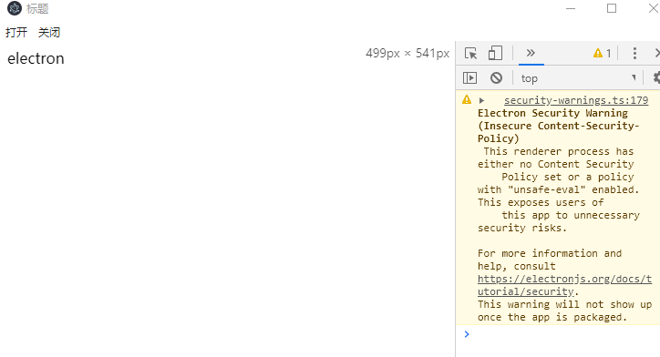

### Electron 入门

### 前言
随着前端技术的日益发展，前端开发从以前的切图仔，发展到了移动 APP, 后端服务，PC 端桌面应用的开发，果真一切能用 JavaScript 实现的东西，都将会用 javaScript 实现，今天我们就来学习一下 PC 端桌面应用开发框架 Electron。


### 1. What  
----  
Electron 是由 Github 开发的，一个用 HTML，CSS 和 JavaScript 来构建跨平台桌面应用程序的一个开源库。

#### 原理
Electron 通过将 Chromium 和 Node.js 合并到同一个运行时环境中，并将其打包为 Mac，Windows 和 Linux 系统下的应用。  

    

其中：
- Chromium 负责构建 web 页面  
Chromium 为Electron 提供强大的UI能力，可以在不考虑兼容性的情况下开发界面

- Node.js 提供文件系统和网络功能  
操作系统底层 API 的能力，Nodejs 中常用的 Path、fs、Crypto 等模块在 Electron 可以直接使用。

- Native APIs   
为了提供原生系统的GUI支持，Electron内置了原生应用程序接口，对调用一些系统功能，如调用系统通知、打开系统文件夹提供支持。  


#### 谁在使用  

<center style="display: flex; justify-content:space-between">
    
   
     
     
      
</center>

等。。。。。。

#### Why
----
- 节省人力人本  
一次编写，多平台运行， Electron 兼容 Mac、Windows 和 Linux，可以构建出三个平台的应用程序

- 对前端友好  
Electron 基于 Chromium 和 Node.js, 让你可以使用 HTML, CSS 和 JavaScript 构建应用。

- 强大便捷的 UI 制作  
Electron 使用 HTML, CSS 和 JavaScript 构建界面应用， 相比于传统的桌面应用来说，更加方便快捷。


### How
Electron 主要运行着有两种进程：『主进程』和『渲染进程』。部分模块只能在两者之一上运行，而有些则无限制。主进程更多地充当幕后角色，而渲染进程则是应用程序的各个窗口，主进程和渲染进程间采用 IPC 进行通信。
  
      


#### 主进程  

主进程的职责是：
- 创建渲染进程（可多个）  
- 控制了应用生命周期（启动、退出APP以及对APP做一些事件监听）
- 存储一些渲染进程共享的数据  
- 调用系统底层功能、调用原生资源  


#### 渲染进程
- 负责 UI 展示以及和用户的交互

Electron 使用了 Chromium 来展示 web 页面，所以 Chromium 的多进程架构也被使用到。 每个 Electron 中的 web页面运行在它自己的渲染进程中。
你可以把渲染进程想像成一个浏览器窗口，它能存在多个并且相互独立，不过和浏览器不同的是，它能调用Node API


#### 主进程和渲染进程 API
主进程和渲染可调用的 API 如下图所示  

  

#### 开发过程

1. 项目初始化  

```bash
mkdir appName
cd appName
npm init

```

2. 安装依赖
```bash
npm install --save-dev electron
```


3. 创建界面窗口
```javascript
/**
 * electron模块包含了 Electron 提供的所有API和功能
 */

// app 代表整个应用程序
const { app, BrowserWindow, Menu } = require('electron')

function createWindow () {   
  // 创建浏览器窗口
  let win = new BrowserWindow({
    width: 800,
    height: 600,
    webPreferences: { 
      nodeIntegration: true, // 是否注入 NodeJs
    }
  })

  // 加载index.html文件 - 可以加载远程或者本地的页面
  win.loadFile('view/index.html')
  // 设置菜单栏
  const menu = Menu.buildFromTemplate([
    {
      label: '打开',
      click: async () => {
        console.log('start---')    
      }
    },
    {
      label: '关闭',
      click: async () => {
        console.log('end-----')  
      }
    }
  ])
  win.setMenu(menu)
  win.webContents.openDevTools()
}
// 当 Electron 初始化完成创建一个窗口
app.whenReady().then(createWindow)
```
其界面效果为  

  

简陋的标题，我们可以用 HTML 去构建菜单，然后点击的时候，何主进程通信， 为了便于开发，我们引入 Vue 进行页面开发

4. 渲染进程内调用 node 功能


5. 渲染进程想关闭应用


#### 5


### 参考文章  
[用JS开发跨平台桌面应用，从原理到实践](https://segmentfault.com/a/1190000019426512)  
[Electron 官方文档](https://www.electronjs.org/)


