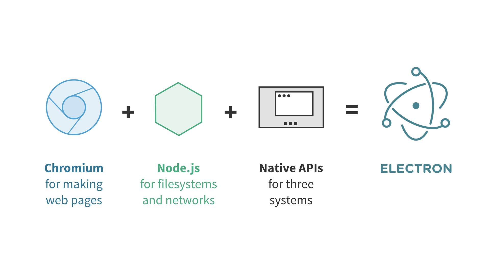
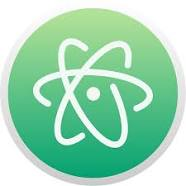
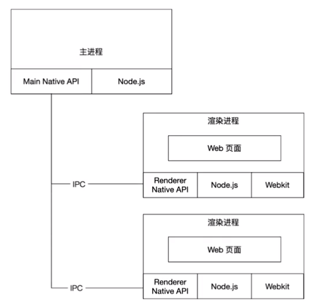
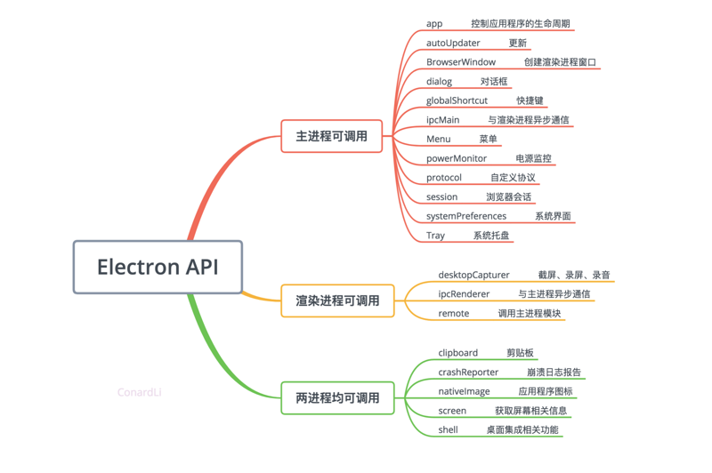
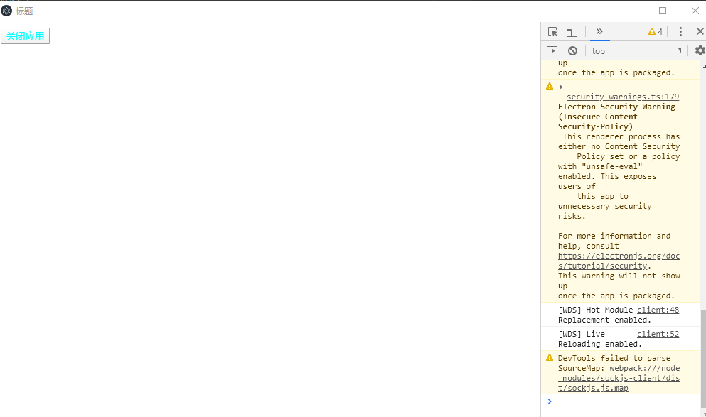
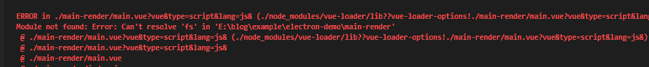
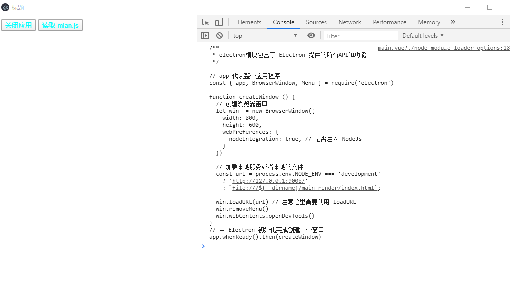
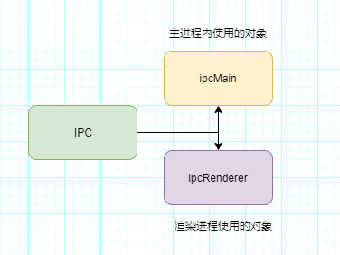
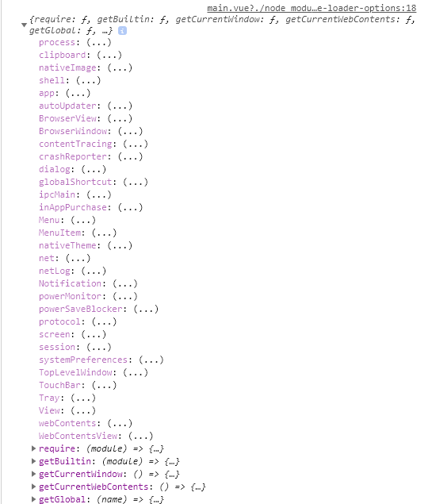

# Electron 入门

## 前言
随着前端技术的日益发展，前端开发从以前的切图仔，发展到了移动 APP, 后端服务，PC 端桌面应用的开发，果真一切能用 JavaScript 实现的东西，都将会用 javaScript 实现，今天我们就来学习一下 PC 端桌面应用开发框架 Electron。


## 1 What  
----  
Electron 是由 Github 开发的，一个用 HTML，CSS 和 JavaScript 来构建跨平台桌面应用程序的一个开源库。

### 1.1 原理
Electron 通过将 Chromium 和 Node.js 合并到同一个运行时环境中，并将其打包为 Mac，Windows 和 Linux 系统下的应用。  

    

其中：
- Chromium 负责构建 web 页面  
Chromium 为Electron 提供强大的UI能力，可以在不考虑兼容性的情况下开发界面

- Node.js 提供文件系统和网络功能  
操作系统底层 API 的能力，Nodejs 中常用的 Path、fs、Crypto 等模块在 Electron 可以直接使用。

- Native APIs   
为了提供原生系统的GUI支持，Electron内置了原生应用程序接口，对调用一些系统功能，如调用系统通知、打开系统文件夹提供支持。  


### 1.2 谁在使用  

<center style="display: flex; flex-diraction: row; justify-content:space-between">
    
   
     
     
      
</center>

等。。。。。。

## 2 Why
----
- 节省人力人本  
一次编写，多平台运行， Electron 兼容 Mac、Windows 和 Linux，可以构建出三个平台的应用程序

- 对前端友好  
Electron 基于 Chromium 和 Node.js, 让你可以使用 HTML, CSS 和 JavaScript 构建应用。

- 强大便捷的 UI 制作  
Electron 使用 HTML, CSS 和 JavaScript 构建界面应用， 相比于传统的桌面应用来说，更加方便快捷。


## 3 How
Electron 主要运行着有两种进程：『主进程』和『渲染进程』。部分模块只能在两者之一上运行，而有些则无限制。主进程更多地充当幕后角色，而渲染进程则是应用程序的各个窗口，主进程和渲染进程间采用 IPC 进行通信。
  
      


### 3.1 主进程  

主进程的职责是：
- 创建渲染进程（可多个）  
- 控制了应用生命周期（启动、退出APP以及对APP做一些事件监听）
- 存储一些渲染进程共享的数据  
- 调用系统底层功能、调用原生资源  


### 3.2 渲染进程
- 负责 UI 展示以及和用户的交互

Electron 使用了 Chromium 来展示 web 页面，所以 Chromium 的多进程架构也被使用到。 每个 Electron 中的 web页面运行在它自己的渲染进程中。
你可以把渲染进程想像成一个浏览器窗口，它能存在多个并且相互独立，不过和浏览器不同的是，它能调用Node API


### 3.3 主进程和渲染进程 API
主进程和渲染可调用的 API 如下图所示  

  

### 3.4 开发过程

#### 3.4.1 项目初始化  

```bash
mkdir appName
cd appName
npm init

```

#### 3.4.2 安装依赖
```bash
npm install --save-dev Electron
```


#### 3.4.3 创建界面窗口
```javascript
/**
 * Electron模块包含了 Electron 提供的所有API和功能
 */

// app 代表整个应用程序
const { app, BrowserWindow, Menu } = require('Electron')

function createWindow () {   
  // 创建浏览器窗口
  let win = new BrowserWindow({
    width: 800,
    height: 600,
    webPreferences: { 
      nodeIntegration: true, // 是否注入 Nodejs
    }
  })

  // 加载index.html文件 - 可以加载远程或者本地的页面
  win.loadFile('main-render/index.html')
  // 设置菜单栏
  const menu = Menu.buildFromTemplate([
    {
      label: '打开',
      click: async () => {
        console.log('start---')    
      }
    },
    {
      label: '关闭',
      click: async () => {
        console.log('end-----')  
      }
    }
  ])
  win.setMenu(menu)
  win.webContents.openDevTools()
}
// 当 Electron 初始化完成创建一个窗口
app.whenReady().then(createWindow)
```
其界面效果为  

  

简陋的菜单和标题，我们可以用 HTML 去构建菜单，然后点击的时候，与主进程通信， 为了便于提高开发效率，我们引入 Vue 进行页面开发


```javascript
// main.vue
<template>
  <div>
    <button>关闭应用</button>
  </div>
</template>
<script>
export default {
}
</script>
<style lang="scss">
  .wrapper {
    > button {
      color: aqua;  
    }  
  }
</style>


// index.js
import Vue from 'vue'
import App from './main.vue'

new Vue({
  el: '#app',
  render: (h) => {
    return h(App)  
  }
})

// webpack.base.config
const path = require('path')
module.exports = {
  devServer: {
    host: '127.0.0.1',
    port: 9008,
    hot: true
  },
  resolve: {
    alias: {
      '@': path.resolve(__dirname, 'main-render') 
    }  
  },
  module: {
    rules: [
      {
        test: /\.vue$/,
        use: [
          'vue-loader'  
        ]
      },
      {
        test: /\.scss$/,
        use:[
          'style-loader',
          'css-loader',
          'sass-loader'  
        ]
      }

    ]
  }
}

// webpack.dev.config.js

var merge = require('webpack-merge');
const base = require('./webpack.base.config')
const path = require('path')
const HtmlWebpackPlugin = require('html-webpack-plugin');
const VueLoaderPlugin = require('vue-loader/lib/plugin')
module.exports = merge(base, {
  mode: 'development',
  entry: path.resolve(__dirname, 'main-render/index.js'),
  plugins: [
    new VueLoaderPlugin(),
    new HtmlWebpackPlugin({
      template: path.resolve(__dirname, 'main-render/index.html') 
    })
  ]
})

```
即是我们通过传统的 vue + webpack 的开发模式来开发渲染进程的页面，我们通过构建本地页面服务，然后再 Electron 主进程中加载本地服务页面

```javascript
/**
* main.js - 主进程
* Electron模块包含了 Electron 提供的所有API和功能
*/

// app 代表整个应用程序
const { app, BrowserWindow, Menu } = require('Electron')

function createWindow () {   
  // 创建浏览器窗口
  let win  = new BrowserWindow({
    width: 800,
    height: 600,
    webPreferences: { 
      nodeIntegration: true, // 是否注入 NodeJs
    }

  })
  //----------------------修改的代码--------------------------------//
  // 加载本地服务或者本地的文件 
  const url = process.env.NODE_ENV === 'development'
    ? 'http://127.0.0.1:9008/'
    : `file:///${__dirname}/main-render/dist/index.html`;

  win.loadURL(url) // 注意这里需要使用 loadURL
  //-------------------------------------------------------//
  win.removeMenu()
  win.webContents.openDevTools()
}
// 当 Electron 初始化完成创建一个窗口
app.whenReady().then(createWindow)
```
其展示结果如下：  

  


#### 3.4.4 渲染进程内调用 Node 功能

我们知道，主进程属于 Node 进程，所以有 Node 服务相关的功能，例如文件操作, 那么渲染进程如何想要操作文件需要怎么处理呢？一般来说，有如下两个实现方法：  

- 渲染进程集成了 Node，可以直接操作文件
- 渲染进程告诉主进程，让主进程帮忙操作文件

下面我们分别用两种方式实现

#### 3.4.5 渲染进程直接使用 Node 模块
我们知道，Electron 在主进程注入了 Node 的环境，所以，我们可以像是在 Node 环境一样 使用 require 方式加载 Node
模块，所以有如下代码：  


```javascript
// main.vue

<template>
  <div class="wrapper">
    <button>关闭应用</button>
    <button @click="selectFile">读取 mian.js</button>
  </div>
</template>
<script>
const fsPromises = require('fs').promises;
export default {
  methods: {
    async selectFile () {
      try {
        const fsHandle = await fsPromises.open('./main.js', 'r')
        const data = await fsHandle.readFile({
          encoding: 'utf-8'
        })
        console.log(data)
      } catch(e) {
        console.log(e)  
      }
    }
  }
}
</script>
<style lang="scss">
  .wrapper {
    > button {
      color: aqua;  
    }  
  }
</style>
```

but。。。。。  

  

what????


造成这个的原因是因为 webpack 处理了 require 命令，导致查找模块的时候会去 node_modules 目录下找，但是因为 fs 模块是 Node 的核心模块，所以在 node_modules 下是找不到的，所以会报错，我们可以改成将 require 命令改成 __non_webpack_require__ (webpack 提供的变量，表示模块不需要 webpack 处理，而是使用当前环境的 require 方法)

```javascript
// main.vue

const fsPromises = require('fs').promises; // -
const fsPromises = __non_webpack_require__('fs').promises; // + 
```

点击读取文件后：  




#### 3.4.6 渲染进程通过通信委托主进程操作

渲染进程委托主进程，这里就涉及到进程间的通信(注意： 渲染进程之间不能直接通信)，在 Electron 中，进程间通信主要有两种方式：

- 通过 IPC
- 通过 remote 远程调用

>IPC nter-Process Communication, 指至少两个进程或线程间传送数据或信号的一些技术或方法

Electron 中，主要提供了两个对象 ipcMain, ipcRenderer 来支持渲染进程和主进程之间的通信

  


渲染进程：

通过 ipcRenderer 给主进程发送消息，并监听主进程回应的数据内容

```javascript
const { ipcRenderer } = __non_webpack_require__('Electron');
export default {
  mounted() {
    // 监听主进程回复事件
    ipcRenderer.on('fileData', (event, data) => {
      console.log(data)  
    })
  },
  methods: {
    async selectFile () {
      // 通知主进程
      ipcRenderer.send('readFile', {
        name: 'main.js' 
      })
    }
  }
}
```

主进程：

监听渲染进程的通知，执行相应操作，并返回结果

```javascript
// 监听渲染进程发来的事件
const { app, BrowserWindow, ipcMain } = require('Electron')
const fsPromises = require('fs').promises;

ipcMain.on('readFile', async (event, args) => {
  try{
    const fsHandle = await fsPromises.open(`${args.name}`, 'r')
    const data =  await fsHandle.readFile({
      encoding: 'utf-8'  
    })
    // 回复消息
    event.reply('fileData', data)
  }catch(e) {
  }
})
```

#### 3.4.7 原生能力 

EElectron 提供了通知，截屏，触摸板，系统托盘等原生操作接口，主要的系统底层功能功能都只能通过主进程调用，渲染进程想要操作系统底层功能的话，一般通过给主进程发送事件，委托主进程操作：

例如想在渲染进程内，调用系统通知：  

```javascript
// main.vue
<template>
  <div class="wrapper">
    <button>关闭应用</button>
    <button @click="selectFile">读取 mian.js</button>
    <button @click="notify">发送通知</button>
  </div>
</template>
<script>
const { ipcRenderer } = __non_webpack_require__('Electron');
export default {
  methods: {
    notify () {
      ipcRenderer.send('notification', {
        title: '你好',
        body: '来自渲染进程的问候'
      })
    }
  }
}
</script>
```

#### 3.4.8. 管理应用状态
在主进程中，应用程序对象 app 提供了很多管理应用程序的方法和事件，比如应用退出，应用隐藏，应用重启等，详细可以参考[官方文档](https://www.Electronjs.org/docs/api/app), 我们可能需要在渲染进程中控制应用的状态，同样这里也有两种方式可以选择：  

- IPC 方式向主进程发送特定事件
- remote 远程调用主进程的方法

IPC 通信和上述文件操作例子类似，这里讲述 remote 远程调用

>remote 模块为渲染进程（web页面）和主进程通信（IPC）提供了一种简单方法。
在Electron中, GUI 相关的模块 (如  dialog、menu 等) 仅在主进程中可用, 在渲染进程中不可用。 为了在渲染进程中使用它们, ipc 模块是向主进程发送进程间消息所必需的。 使用 remote 模块, 你可以调用 main 进程对象的方法, 而不必显式发送进程间消息

```javascript
<template>
  <div class="wrapper">
    <button @click="quitOut">关闭应用</button>
    <button @click="selectFile">读取 mian.js</button>
    <button @click="notify">发送通知</button>
  </div>
</template
<script>
const { app } = __non_webpack_require__('Electron').remote;
export default {
    quitOut () {
      app.quit()
    }
  }
}
</script>
```
点击关闭应用，即可直接退出应用程序

我们可以看看 remote 中提供了那些可远程调用的对象：  

 

也就是这些方法，我们都可以在渲染进程，通过远程调用 remote 方式调用，就像是在主进程使用一样。


## 4 End
Electron 以其强大的 UI 构建，和跨平台能力极大的提高了应用的开发效率，最小化的节约了开发成本，但是🐟和熊掌不可兼得，Electron 在带来及其方便的同时，也带来了一些挑战，其中比较大的缺点是内存占用大(因为其内置了 Chromium), 同时，对于也存在源码泄露的风险


对于其中优化以及代码保护相关的内容，可[点击这里](https://github.com/zhijs/blog/blob/master/%E6%80%9D%E7%BB%B4%E5%AF%BC%E5%9B%BE/images/Electron.jpg)  


### 参考文章  
[用JS开发跨平台桌面应用，从原理到实践](https://segmentfault.com/a/1190000019426512)  
[Electron 官方文档](https://www.Electronjs.org/)


